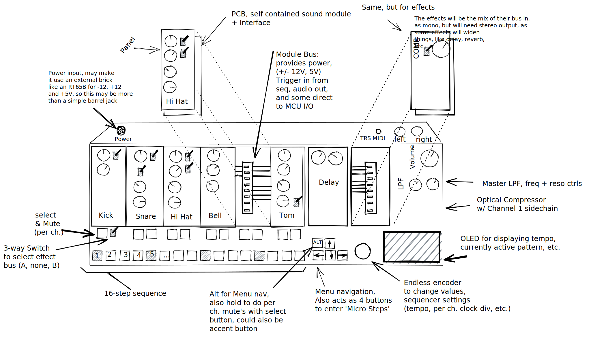

# Capstone Idea - Analog Drum Machine

## Tenative Feature List:

### Modular Design

- Modular Sound Cartridges & Effects
- Effect carts work on bus system
  - A and B bus, selectable per module
- Panel and module are self contained
  - Allows for tailored inputs, and even digital modules
- Bus provides extra I/O, just in case
  - Each module would have a few lanes to the μC, this might allow for per-step randomization, two digital modules to communicate, etc.

### Master Channel

- Filter with Resonance
  - MS-20 would be crunch and nice if analog, Stave varibale may allow for switching HP/LP/BP from the MCU with an analog mux?
- Master volume - Stereo
- [TODO] Would we need balanced out?

### Sequencer

- Option for "Micro Steps"
- Option for Accents
- Per Channel mutes
- Pattern Chaining
- Tempo control
  - Per channel clock division/multiplication?
  - MIDI sync?
  - Polyrhytms (Multiple clocks)?
  - Euculidian Clocking?
- Might add a few extra channels of samples based playback, on top of the analog playback? Maybe 8Analog/8Digital, sorta a like the [Analog Rythm](https://www.elektron.se/products/analog-rytm-mkii/)
- [TODO] See sequencers from VCV 

## Sound Module Ideas

There's no reason these would all have to be analog, could easily use drop in secondary micros, and even mix and match controllers

- 808 clones
- Plukced Filters
- Karplus Strong
- Filtered Noise
- Atari Punk Console circuit may work too (two 555's one Astable, one Monostable)

## Effect Module Ideas

Effect modules need to output a duplicate signal if only acting as mono, to keep the output stereo

* BBD Delay
* Germainum fuzz
* VFD drive

## Various Resources:

[The section about percussion on Vega's website](https://opguides.info/music/instruments/perc/)

[ECE4450 Analog Circuits for Music Synthesis (Youtube, Georgia Tech)](https://www.youtube.com/watch?v=mYk8r3QlNi8&list=PLOunECWxELQS5bMdWo9VhmZtsCjhjYNcV)

[single tranistor oscillator](https://www.youtube.com/watch?v=zCTLeNxge54)

[T Network?](https://www.perfectcircuit.com/addac-103-black.html)

[Video explaining how the Digitakt sampling drum machine works](https://www.youtube.com/watch?v=MXexVHNO0ms)

