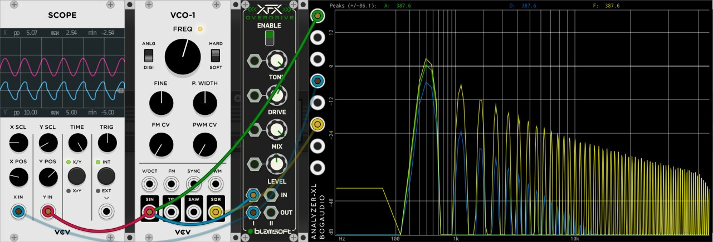

# Vega Carlson - Group 165 - Fall '21, Week 1

## Monday, Aug 2nd W:1.50 T:1.50 

**1.5 hr** coming up with ideas and thinking about feasibility. Ideas included an envelope generator with per-stage modulation and smooth transitions, a VGA based video effect synthesizer combining digital generation with analog feedback, a wavetable oscillator with either a germanium or VFD based distortion stage, a MIDI controller implementing some of the MIDI 2.0 spec, an analog drum machine, a digital drum machine, a plotter to draw generative art generated by the μC, and an IOT device with analog gauges and small OLED screens. Each of these would be somewhat based on prior art. Respectively, the [XAOC Zadar](http://xaocdevices.com/main/zadar/); the [Pimoroni RPPico Board](https://shop.pimoroni.com/products/pimoroni-pico-vga-demo-base) and [Sleepy Circuits Hypno](https://sleepycircuits.com/hypno); [Various past examples of using a VFD as an amplifer](https://hackaday.com/2013/11/09/vfd-display-becomes-an-amplifier/); [The MIDI 2.0 spec](https://www.midi.org/specifications/midi-2-0-specifications)'s significantly greater capabilities; the [TR-808 drum machine](https://en.wikipedia.org/wiki/Roland_TR-808); the [Elektron Digitakt Drum Machine](https://www.elektron.se/products/digitakt/); [The Plotter Art subreddit](https://www.reddit.com/r/PlotterArt/); and the [Quirky Nibus](https://www.wink.com/downloads/help/quirkyge-nimbus-digital-dashboard-and-clock/user-guide.pdf). 

## Tuesday, Aug 3rd -- W:5.00 T:5.00

**1.5 hr** forming our group, going though the above listed ideas and narrowing the selection down to our main choice, the analog drum machine, and a backup, the VGA synth. Some time was spent explaining the basic concept of what a drum machine is to the group, providing context on how a potential high level design may work for this class, etc.

**2hr** getting the analog drum machine concept off the ground, and getting resources prepared to show the rest of the group and better explain the concept I had in mind. A tentative, high level feature list was made and a concept sketch produced: 

This was also uploaded to github: [https://github.com/VegaDeftwing/AnalogDrumMachine](https://github.com/VegaDeftwing/AnalogDrumMachine)

## Wednesday, Aug 4th -- W:7.25 T:7.25

**1hr** Refinements of the concept sketch and feature list

**1hr** Some research was also done looking into potential circuits. I dove into Bucket Brigade Chips pretty hard, looking for what might be needed to implement Karplus Strong Synthesis, I found [this page about BBD circuits](http://www.sdiy.org/BBDHell/BBD-Manual.pdf) with some reference implementations and data about some of the most common ICs.

**15min** explaining to the group how what is normally called distortion in the music world is just "squaring up" a signal, adding harmonics

## Thursday, Aug 5th -- W:8.00 T.8.00

**45min**  Thinking about the modular connections. Making a very large PCB would be prohibitivly expensive, so potentially using something like this [24 pin](https://www.amazon.com/Davitu-Connector-3-96mm-Solder-Socket/dp/B07MD3GMCP/ref=pd_lpo_2?pd_rd_i=B07MD3GMCP&psc=1) PCB edge connectior would work well ,then just have each of those mounted on a small PCB that then connects back to the main board using [9 pin JST connectors](https://www.amazon.com/LATTECH-Female-Connector-Electric-Length/dp/B07Q8RTNMF/ref=sr_1_3?dchild=1&keywords=9+pin+jst&qid=1630000964&s=industrial&sr=1-3). This also has the advantage of making the final case design more flexible, as these edge connected daughter boards could move around. The downside? The PCBs with each drum module will probably need to be at 90° to the main board or have a weird extension PCB to adapt to the right angle

This incurs a downside where the PCB max size will be limited by the module depth, which is almost certainly smaller than the just a hair smaller than the pannel W*H that would be possible without this 90° rotation. and makes stacking PCBs for more complexity much more awkward. It could be that none of our circuits will have issues meeting these size constraitns, but it is a tough call to make early on. the edge connector could still be adapted with right angle pin headers, but if that's done applying the force to slot the card in may cause mechanical failures.

## Friday, Aug 6th -- W:9.50 T:9.50

**1.5hr** Group meeting, making timeline

---

**Week ending 8/27 total = 9.5hrs**

