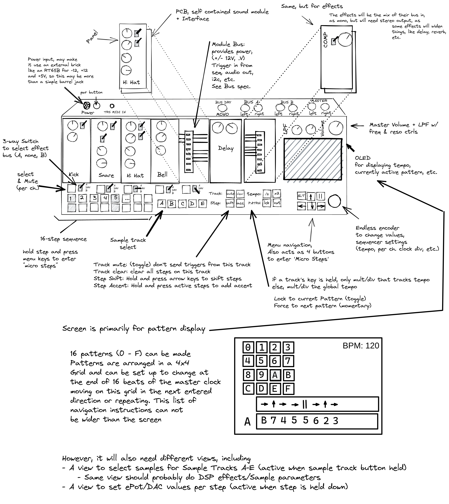

# Vega Carlson - Group 165 - Fall '21, Week 4

## Saturday, Sep 11th -- W:0.00 T:23.00

**0.00 hr** -- No Progress today

## Sunday, Sep 12th -- W:0.70 T:23.70

**0.2hr** -- Briefly looked into the 909 drum machine, before realizing that its circuits are dramatically more complicated than the 808's

**0.5hr** -- Read about how Leonardo Laguna Ruiz, the guy behind Vult DSP, does his Analog modeling and then talked with him a bit on some fourms in the hopes to fix some of our problems with simulation. This didn't really go anywhere useful unfortunately

## Monday, Sep 13th -- W:1.00 T:24.00

**0.3hr** -- Worked with ried building circuits in the lab

## Tuesday, Sep 14th -- W:2.30 T:25.30

**1.30hr** -- Researched the Black Pill (STM32F411) & Pi Pico (RP2040) to see how their development chain looks & feels, with a particular focus on MIDI over USB libraries as implimenting from that from scratch would be a massive pain. Starting with the pico running circuitPython, as while there seem to be some raw-C implimentions of MIDI over USB on the pico, there's really no reason not to use circuitPython and ease development if we can.

The Pi-Pico just works with CircuitPython. Using [This](https://blog.4dcu.be/diy/2021/05/20/MIDIpad.html) as example code and it's already functioning. Obviously we'd still have to write all the logic for the sequencer, but this is looking very promising. **however,** using circuitPython limits  us to only using one of the two cores on the pico. If necessary we might be able to get microPython working, which does support threading, and use [this hopefully still functional](https://github.com/cjbarnes18/micropython-midi) library. Another option is to do as that library recomends and just shoot data down the serial port and convert it to midi on the full-size pi we'll have in the project too; however, that is less than idea as class compliance just generally makes everything a bit easier. Using circuit python can also be seen as a feature for the end user too, as it means the function of the micro controller itself is end-user programmable, which for some things may be usefull- for example a user might want to adjust the timing for debouncing (to enable faster tripple-pres inputs) or add some weird feature like a "trigger all" channel

On the blue/black pill, the libopencm3 RTOS is an option and does provide a USB-MIDI library. Other options include the [USBComposite](https://github.com/arpruss/USBComposite_stm32f1) arduino library for STM32F1(bluepill) devices. For the Blackpill (F411, not the F401), it does appear it's possible to use microPython (not circuitPython) and a midi library. There's also [MBED](https://os.mbed.com/cookbook/USBMIDI) which has a [USB-MIDI](https://os.mbed.com/docs/mbed-os/v6.14/apis/usbmidi.html) library. I have some prior experiance with mbed- the biggest feature for us would be its [Event handeling](https://os.mbed.com/docs/mbed-os/v6.14/apis/scheduling-rtos-and-event-handling.html) systems, which would make setting up a sequencer pretty easy. All of these are reasonable options should we not be able to use the pico, but until we have reason not to I don't see reason to explore them further as the pico really does appear to be the best option.

Finally, boards using 32u4 which works with the normal arduino midi library remains an option, albeit one I have had experiance with in the past where the μC was dramatically underpowered.

## Wednesday, Sep 15th -- W:2.80 T:25.8

**0.5hr** - Meeting w/ Bauer

## Thursday, Sep 16th -- W:5.00 T:28.00

**0.2hr** - Placed order for pico's with adafruit. Got 3, keeping 2 for myself for personal projects (not ordering though the dept')

**1.0hr** - Bus selection, looking at i2c part options

**0.5hr** - Looking at part options for inputs - silicon buttons, cherry mx switches, rotary encoders, etc. Just trying to get a sense of our options and pros/cons. Cherry mx swiches may be a tad awkward for putting an LED under as most are designed for though hole and an SMD RGB LED will probably light it up awkwardly or have bleed. More research is necessary.

**0.5hr** - Got a pi hooked back up to SSH into at least, it has an old install of Raspbian. I'll need to set it up on a KVM and probably look into options for pi RT Kernel builds. I might poke my friends over at https://sleepycircuits.com who have a CM3 based video synth module they're pushing to its limits, see if they have any recomendations. I still have an older pull of their git repo from when I let them know they'd accidently left their not-supposed-to-be-public git repo baked into the "firmware image" (a `dd` of the pi's SD card after a raspbian install + their special sauce) so it might be worth just poking that to see what config changes they've done to raspbian.

## Friday, Sep 17th -- W:8.00 T:31.00

**.7hr** - Met up with Kaleb in the morning to discuss project - namely bus structure and decisions about drum complexity

**1.2hr** - Group meeting, see minutes

**1.1hr** - Redesign of concept sketch

---

**Week ending 9/17 total = **8.0 hours

