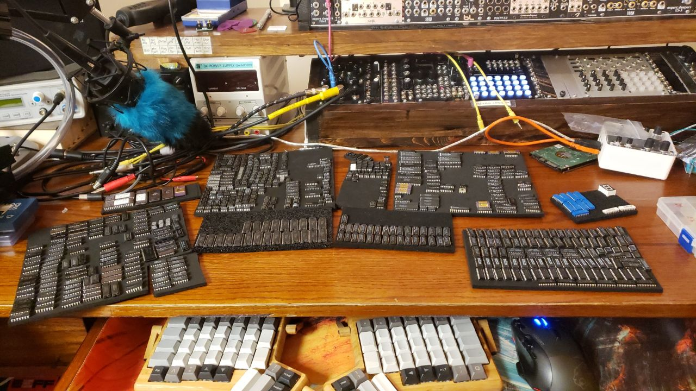

# Vega Carlson - Group 165 - Fall '21, Week 8

## Saturday, Oct 9th -- W:0.00 T:55.00

**0.0 hr** -- No Progress today

## Sunday, Oct 10th -- W:0.00 T:55.00

**0.0hrs** -- No Progress today

## Monday, Oct 11th -- W:1.0 T:56.00

**1.0hr** -- In reality I spent about 6 hours sorting and organizing my components. I'm counting it as an hour here though as a part of why I finally did it was because I needed to find some parts for the project. The IC sorting was by far the biggest task here, but I did find multiple parts that may come in handy, so it was worth it. Also, apparently I have 50 different OpAmps?

## Tuesday, Oct 12th -- W:1.7 T:57.7

**0.7hrs** -- Ordered stuff from PiMoroni, struggled to find option for the Digipots. The MCP4642 in particular looks like our best option, but it's only in 10MSOP, which means we'll need something so that we can have our chips with DIP, but all of the adapters are 3x the cost of the chip. Planning to ask for help tomorrow.

## Wednesday, Oct 13th -- W:4.5 T:60.5

**0.5hr** -- Meeting with Bauer

**0.6hr** -- Worked in lab with others

**0.8hr** -- Updating timeline, considering implications of using basic pin headers for bus→Should we use flying cables instead of a plug-in bus to remove the 7 bus-bottom PCBs?

**.9hr** -- Looked at available python libraries and considered direction of the code and how the responsibilities will be divided. Oddly, due to [This python→PureData](https://github.com/automata/topd) library (or [this one](https://github.com/aalex/purity)) (or [this one, which is at least actively maintained](https://github.com/grrrr/py)), it might actually be easier to use PD as the sound/effects processing. This still makes loading in drum samples an option, but prevents the need for audio processing in the python threads, making real time easier, ironically. As a bonus, it means we could also synthesize our drums in real time instead of using samples, which really opens up some cool options. Of note, stock PureData is pretty awful, so it might be worth it to see if these libraries work with [Purr-Data](https://agraef.github.io/purr-data/), the main fork used by the community.

## Thursday, Oct 14th -- W:5.5 T:61.5

**1.0hr** -- Decided we really ought to order 256 step, 100k digipots instead of 128 step 50k. It's negliable in price, and if we want 50k we can just use half the range. Worked on code a smidge, just trying to figure out what libraries will be doing what and what hardware (pico v pi) handles what. Looked into using Pure-Data more, that not 12 year old library looks promising still, but I'm having a hard time wrapping my mind around it. It seems like it might require that the python code actually be loaded *inside* of puredata, so the abstraction is sort of more, erm, encompasing(?) than I'd realized. I'd rather it be such that the python code sends commands to re-patch the PD stuff, which is how I think the older libraries did it, but this might work too. Should I shoehorn the code into a weird abstraction? Probably not. Do I still think it's worth trying? Absolutely. I might be able to abuse a [named pipe](https://www.eadan.net/blog/ipc-with-named-pipes/) to get IPC working semi-reasonably as well. This is definitely a weird way of doing things and probably **seems** overly complicated, but the alternative is trying to get python code to mix samples and do audio effects, which is equally square-peg-in-a-round-hole, so I'm pretty much just picking the poison here. I also might be able to just use a virtual midi loopback device for getting most of the data between PureData and the python code, and make some midi messages mean non-standard things, like sample change. This isn't good practice, but it should work. There's also the option of using OSC, a weird never-quite-caught-on alternative to MIDI that PD supports and there are plenty of python libraries for. It's a bit higher resolution for messages and may work better for this application. Of the three options, I really don't know what is best, so I'm probably just going to start with abused-MIDI and try to write code that can be changed easily if that's a bust. 

## Friday, Oct 15th-- W:8.1 T:64.1

**1.6hr** -- Started working on high level pseudo code, and realized I don't actually know which device (pi, pico, or keyboard 32u4's) would be handling the lighting of the steps on the keyboard, then realized that the idea of shining light though the keystem from underneath for the Pyrool/Alpha board won't really work- so back to the drawing board there. At this point, I think our best bet may just be to hand wire it. A small, hand wired keyboard isn't impractical

(image from https://www.masterzen.fr/2018/12/16/handwired-keyboard-build-log-part-1/)

and we could drive the LEDs with the [IS31FL3731](https://www.adafruit.com/product/2946) which is supported by QMK, though it would probably be easier to have it actually be controlled by the pico directly

**1.0hr** -- Meeting + worked in lab on FM drum with Ried

---

**Week ending 10/15 total = **8.1 hours

