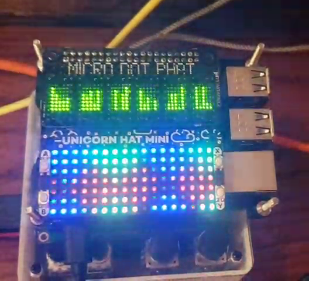

# Vega Carlson - Group 165 - Fall '21, Week 10

## Saturday, Oct 23rd -- W:0.00 T:69.3

**0.0 hr** -- No Progress today

## Sunday, Oct 24th -- W:2.70 T:72.0

**2.7hrs** -- MicroDot Phat soldered, pi re-flashed, ssh setup (-ish need to get keybased auth setup with group), etc. normal making a pi happy things. Display hats both tested: all LEDs work. I don't have a USB power meter and the 3b+ is on a 5.1V, 3A supply, but I checked the temp after letting it run for a while: ~53.5°C, which is not much above idle (~50.5°C, room is quite warm though), which implies to me the hats shouldn't cause thermal issues, which I was worried about. power draw will still need tested at some point before we settle on a power solution for the project as a whole; however, the Meanwell RT65-b that were were likely going to use provides more juice than this, so shouldn't be a problem regardless, espically as the HID keyboards should draw very little current.

I still need to test the audio hat (hiding under the unicron hat) for output in general and quality (will having two display hats drinking variable current cause noise?)

Currently, to actually test everything, we still need the SOP10 breakout boards for the digipots + the if-it-exists i2c analog mux, the two keyboards (BDN9 + handwired) and a few drums on a breadboard with a simple mixer. For now I think we'll just continue to ignore the effects section, as it's independent enough that if push-comes-to-shove it can be dropped from the project or replaced with a much simplier alternative.

The group is still basically split up, with Cole, Kaleb, and Reid handling the analog drums to the extent they can without some of my background on what we're going for and grander project vision, while I'm trying to hammer out code and get all the different pieces interconnecting as smoothly as possible. The hardest part of this has been trying to be an oracle of sorts and forsee future foot-guns, but so far I think that has gone well except for the failure to find a good, primary input device requiring the need for the hand wired keyboard. With this semester past the half way point, I'd be lying if I didn't express at least some concern simply due to scale and unforseen difficulty. I had assumed the analog drums would have gone much smoother, given that we are mostly using well known circuits with minor modifications, but the issues so far have eaten far more time than I could have anticipated and making that keyboard by hand will take time and more-likely-than-not a fair amount of hardware debugging. All of that said, I *feel* that we're almost at the top of that analog drum hill, and that it will be smoother going forward and I do have significant prior experiance with QMK, the keyboard firmware that both the BDN9 and handwired keyboard will be using.

For the keyboards, we'll probably print off https://www.thingiverse.com/thing:4742993 and get the handwired board started using that. When the project gets further, we can just remove the bottom and mount the top into the unified project enclosure. It won't be perfectly clean, but there's a chicken-and-egg problem with trying to get the keys into a unified enclousre before we really have those dimensions set in stone, so this modular approach for prototyping is the best we can do. As a bonus, while it's being worked on, the bottom plate serves to protect the hand-wired work. I'd like to use some clear filament [(amazon?)](https://www.amazon.com/SUNLU-Filament-Transparent-Dimensional-Accuracy/dp/B07ZNG4L9P/ref=asc_df_B07ZNG4L9P/?tag=hyprod-20&linkCode=df0&hvadid=459577916351&hvpos=&hvnetw=g&hvrand=9817620569099687049&hvpone=&hvptwo=&hvqmt=&hvdev=c&hvdvcmdl=&hvlocint=&hvlocphy=9024517&hvtargid=pla-1136132240832&psc=1) for this though, in an attempt to make it somewhat match the end product, and because I'll probably be supplying the parts all out-of-pocket to keep it when done, and I think being able to see the hand wiring is neat.

I talked with Reid and he's ordering the BDN9 macropad out of pocket so he can keep it when done. It's ~$40 + keys and caps, which I have on hand. I ordered the LED matrix driver for the hardwired board.

Looked at options for the analog mux for the toms. There's not really any good direct i2c control options that aren't ludiciously expensive, so our best bet might be the common CD74HC4067M96 analog mux IC, which has exposed binary select pins, and an I2c IO expander like the MCP23017, as combined they're still ~$2 vs the \$6+ bom hit per IC of the only integrated solution I could find.

## Monday, Oct 25th -- W:5.0 T:74.3

**2.3hrs** -- Got libraries installed, got ssh development setup with VSCode so that I don't have to write everything in nano or vim, got the screens displaying a little startup message, tested audio output hat- it sounds good with no audible decrease in quality/noise when the display hats are active. Also got song save/load functionality and a basic system for detecting if peripherals are attached to the pi started. Doing some napkin math on song save load, I might need to be careful about memory usage. If I assume each micro-step needs ~3bytes of data associated with it, that puts each song at ~30kb, not bad, but I think I might be underestimiting the overhead of objects in python as well. For now though, I just have everything in memory (all 16 songs). If it's a problem, I'll deal with it then.

## Tuesday, Oct 26th -- W:5.0 T:74.3

**0.0hr** -- no progress today

## Wednesday, Oct 27th -- W:6.0 T:75.3

**1hr** -- Meeting in lab with everyone

## Thursday, Oct 28th -- W:7.5 T:76.8

**1.5hr** -- Code cont. got pattern sequencing working and showing up on the display. Looks really good in person, but bad on camera.

Also got the i2c LED driver for the handwired keyboard in today as well as put in the 3D print job for the handwired keyboard with the EE shop. With luck, all the parts to start the handwiring should be here next Thursday, though I may be able to get started on it earlier than that. I'm starting to be at an awkward point with code until the keyboards are done.

## Friday, Oct 29th-- W:8.5 T:77.8

**1.0hr** -- Meeting with group, see minutes + general discussion & work in lab

Got the 3D printed keyboard case from the EE shop and get the switches put into the holes. Nothing has been wired yet.

---

**Week ending 10/28 total = **8.5 hours

