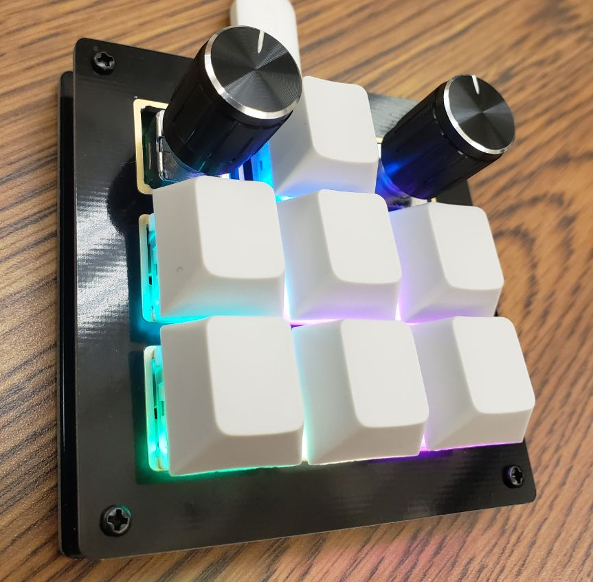
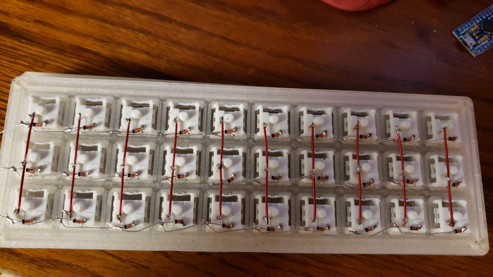

# Vega Carlson - Group 165 - Fall '21, Week 11

## Saturday, Oct 30th -- W:0.00 T:77.8

**0.0 hr** -- No Progress today

## Sunday, Oct 31st -- W:0.00 T:77.8

**0.0hrs** -- No Progress today

## Monday, Nov 1st -- W:1.2 T:79.0

**1.2hrs** -- Worked in lab with Reid. Got the KeebIO BDN9 built, and got the FM drum's enevolpeing via LPG sounding astoundingly good - https://www.youtube.com/watch?v=WhCHzIl4wn0 -- note, this was recorded though the phone's mic and it sounds much better in person

## Tuesday, Nov 2nd -- W:3.9 T:81.7

**2.7hr** -- Got the key matrix for the hand wired keyboard soldered. It's not yet hooked up to a microcontroller, but doing continutiy tests, I see no reason it shouldn't all work. This was, frankly, some of the most tedious soldering I've ever done, and I've put together some much larger in solder joint count eurorack kits. I realized I had a bit of a face palm moment and don't actually have the correct size LEDs for the keyboard either, so I'll need to order those before the per-key LED matrix can be wired up- in the mean time I should be good to finish the key matrix and get it tested at least.

## Wednesday, Nov 3rd -- W:4.9 T:82.7

**1hr** -- Meeting with Bauer + work in lab 

## Thursday, Nov 4th -- W:7.0 T:84.8

**2.1hr** -- Got the QMK keyboard firmware toolchain set up on the pi after more struggling than anticipated, mostly due to there being no good list of dependencies, so I had to put out fires one by one until it stopped complaining. Then spent almost two hours fighting the RGB implimentation, as the documentation made it as confusing as possible. Finally decided to get in the QMK discord and ask, and was more-or-less immediately helped by one of the main contributors to the project, and, yep, it's as confusing as it seems. Due to how things are laid out I'll actually need to define an ['animation' file](https://github.com/qmk/qmk_firmware/tree/master/quantum/rgb_matrix/animations) that handles the logic. Fortuntately, there's an [outstanding PR](https://github.com/qmk/qmk_firmware/pull/13036/files) that is doing something pretty similar to what I need to do that I should be able to steal from. It's frustrating to have killed two hours and not made much progress, but oh well, at least I learned a bit.

## Friday, Nov 5th -- W:9.0 T:86.8

**2.0hr** -- Meeting + work in lab with Kaleb doing soldering. It didn't go overly well.

---

**Week ending 11/5 total = **9.0 hours

