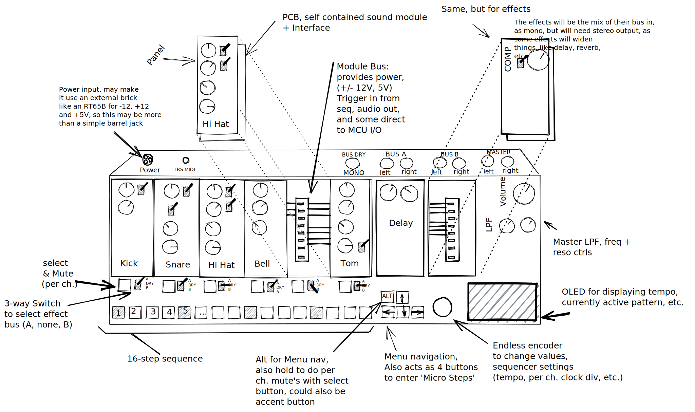
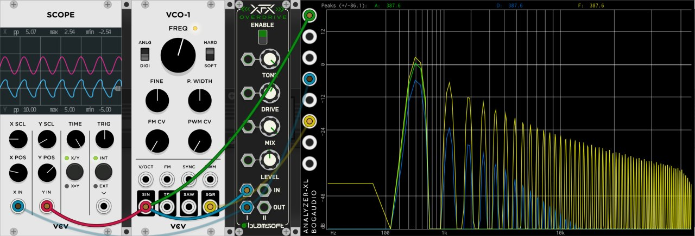
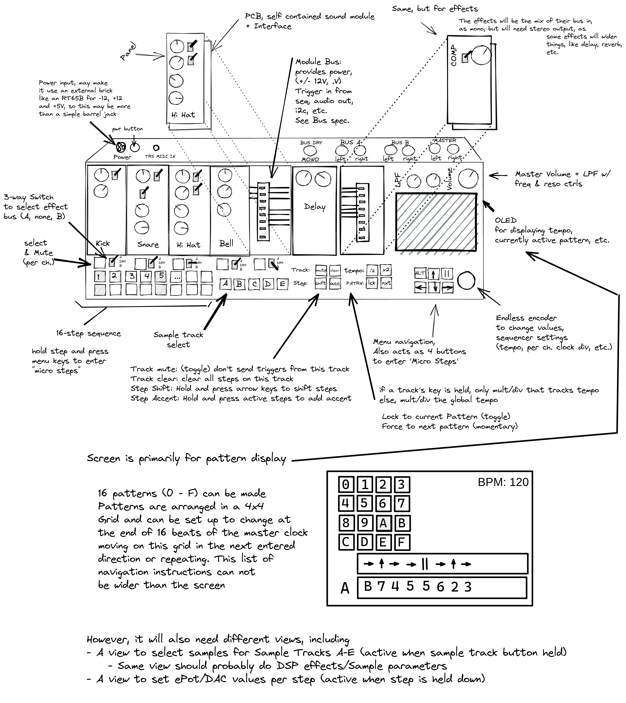
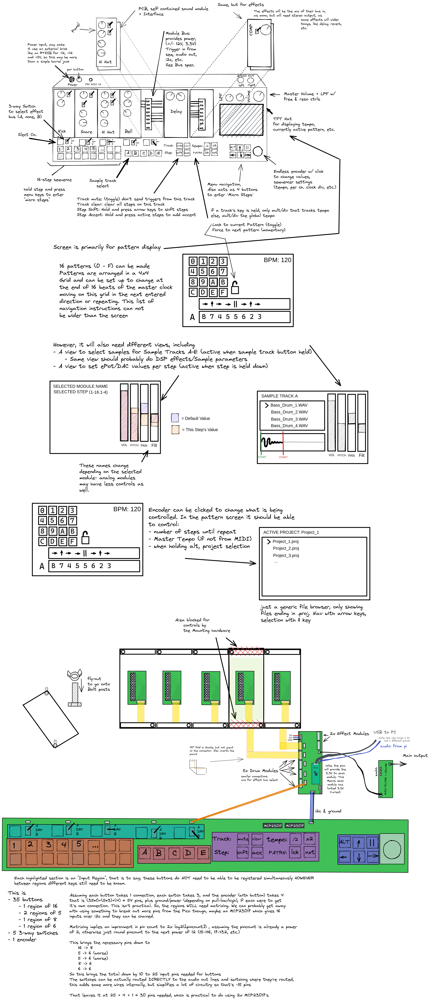
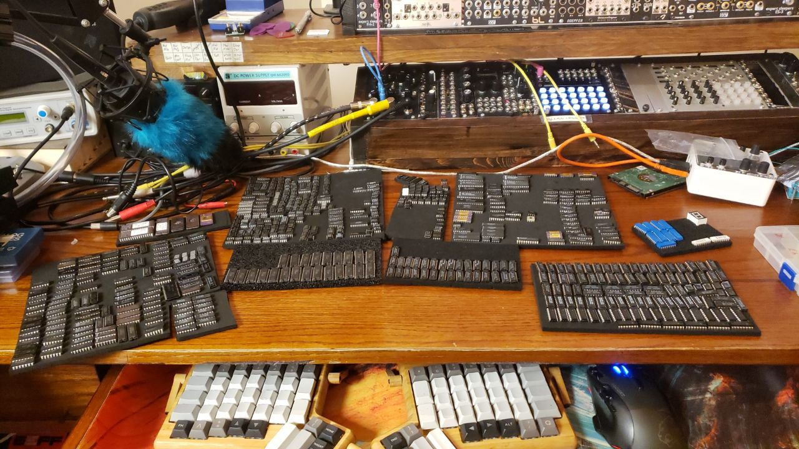
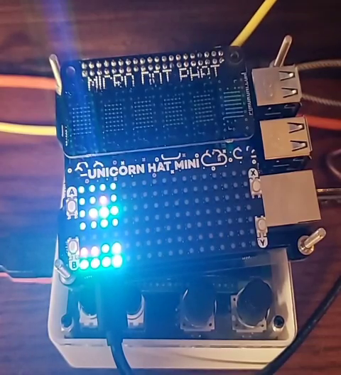
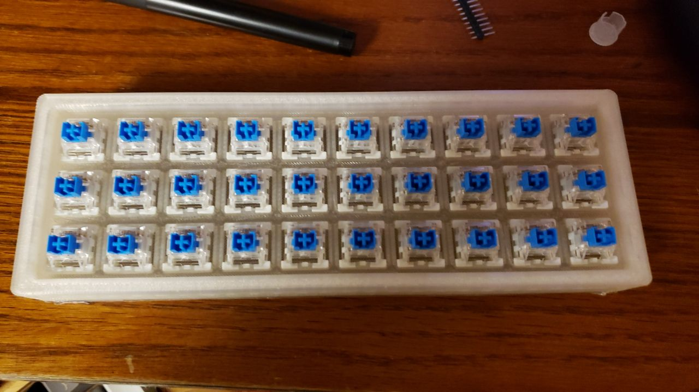
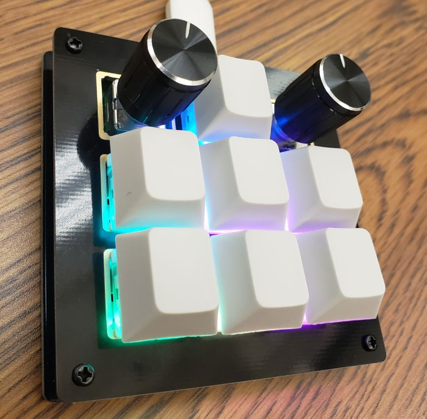
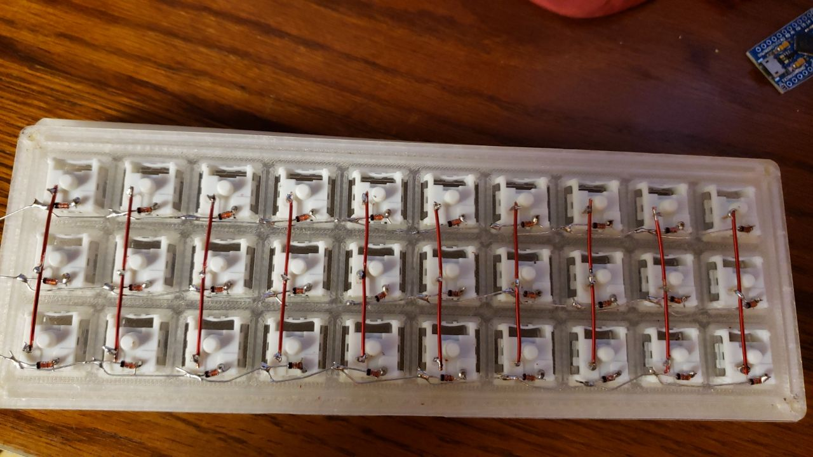

[TOC]

# Vega Carlson - Group 165 - Fall '21, Week 1

## Monday, Aug 2nd W:1.50 T:1.50 

**1.5 hr** coming up with ideas and thinking about feasibility. Ideas included an envelope generator with per-stage modulation and smooth transitions, a VGA based video effect synthesizer combining digital generation with analog feedback, a wavetable oscillator with either a germanium or VFD based distortion stage, a MIDI controller implementing some of the MIDI 2.0 spec, an analog drum machine, a digital drum machine, a plotter to draw generative art generated by the μC, and an IOT device with analog gauges and small OLED screens. Each of these would be somewhat based on prior art. Respectively, the [XAOC Zadar](http://xaocdevices.com/main/zadar/); the [Pimoroni RPPico Board](https://shop.pimoroni.com/products/pimoroni-pico-vga-demo-base) and [Sleepy Circuits Hypno](https://sleepycircuits.com/hypno); [Various past examples of using a VFD as an amplifer](https://hackaday.com/2013/11/09/vfd-display-becomes-an-amplifier/); [The MIDI 2.0 spec](https://www.midi.org/specifications/midi-2-0-specifications)'s significantly greater capabilities; the [TR-808 drum machine](https://en.wikipedia.org/wiki/Roland_TR-808); the [Elektron Digitakt Drum Machine](https://www.elektron.se/products/digitakt/); [The Plotter Art subreddit](https://www.reddit.com/r/PlotterArt/); and the [Quirky Nibus](https://www.wink.com/downloads/help/quirkyge-nimbus-digital-dashboard-and-clock/user-guide.pdf). 

## Tuesday, Aug 3rd -- W:5.00 T:5.00

**1.5 hr** forming our group, going though the above listed ideas and narrowing the selection down to our main choice, the analog drum machine, and a backup, the VGA synth. Some time was spent explaining the basic concept of what a drum machine is to the group, providing context on how a potential high level design may work for this class, etc.

**2hr** getting the analog drum machine concept off the ground, and getting resources prepared to show the rest of the group and better explain the concept I had in mind. A tentative, high level feature list was made and a concept sketch produced: 

This was also uploaded to github: [https://github.com/VegaDeftwing/AnalogDrumMachine](https://github.com/VegaDeftwing/AnalogDrumMachine)

## Wednesday, Aug 4th -- W:7.25 T:7.25

**1hr** Refinements of the concept sketch and feature list

**1hr** Some research was also done looking into potential circuits. I dove into Bucket Brigade Chips pretty hard, looking for what might be needed to implement Karplus Strong Synthesis, I found [this page about BBD circuits](http://www.sdiy.org/BBDHell/BBD-Manual.pdf) with some reference implementations and data about some of the most common ICs.

**15min** explaining to the group how what is normally called distortion in the music world is just "squaring up" a signal, adding harmonics

## Thursday, Aug 5th -- W:8.00 T.8.00

**45min**  Thinking about the modular connections. Making a very large PCB would be prohibitivly expensive, so potentially using something like this [24 pin](https://www.amazon.com/Davitu-Connector-3-96mm-Solder-Socket/dp/B07MD3GMCP/ref=pd_lpo_2?pd_rd_i=B07MD3GMCP&psc=1) PCB edge connectior would work well ,then just have each of those mounted on a small PCB that then connects back to the main board using [9 pin JST connectors](https://www.amazon.com/LATTECH-Female-Connector-Electric-Length/dp/B07Q8RTNMF/ref=sr_1_3?dchild=1&keywords=9+pin+jst&qid=1630000964&s=industrial&sr=1-3). This also has the advantage of making the final case design more flexible, as these edge connected daughter boards could move around. The downside? The PCBs with each drum module will probably need to be at 90° to the main board or have a weird extension PCB to adapt to the right angle

This incurs a downside where the PCB max size will be limited by the module depth, which is almost certainly smaller than the just a hair smaller than the pannel W*H that would be possible without this 90° rotation. and makes stacking PCBs for more complexity much more awkward. It could be that none of our circuits will have issues meeting these size constraitns, but it is a tough call to make early on. the edge connector could still be adapted with right angle pin headers, but if that's done applying the force to slot the card in may cause mechanical failures.

## Friday, Aug 6th -- W:9.50 T:9.50

**1.5hr** Group meeting, making timeline

---

**Week ending 8/27 total = 9.5hrs**

# Vega Carlson - Group 165 - Fall '21, Week 3

## Saturday, Sep 4th -- W:0.00 T:17.50

**0.00 hr** -- Sick, no progress today

## Sunday, Sep 5th -- W:0.00 T:17.50

**0.00hr** -- Sick, no progress today

## Monday, Sep 6th -- W:1.50 T:19.00

**1.50hr** -- Sick. Counting some of my work reseaching the MIDI protocol to write up [this page](https://opguides.info/music/midi/) on my website. This actually took **hugely more than 1.5 hours**, but was for a personal project outside of any class; however, it has serious ovelap with this project, so I thought should count for something. It's also about the only thing I could do while feeling this bad, as staring at circuits was physically painful.

## Tuesday, Sep 7th -- W:1.50 T:19.00

**0.00hr** -- Sick, no progress today

## Wednesday, Sep 8th -- W:3.00 T:20.50

**0.5hr** -- Group meeting with Bauer, discussed state of the project, talked about the indistructable laptops

**0.5hr** -- Worked with LiveSpice to get circuit simulation with live audio output working

**0.5hr** -- Worked with Reid to compare time and frequency domain output of an 808 emulation to our simulation. We figured out the simulator doesn't like the way we're making white noise.

## Thursday, Sep 9th -- W:4.00 T:21.00

**1.0hr** -- Researched potential of using a pi as "The Brain" of the system instead of using strictly μC's. Assuming using higher level languages on the pi is allowed it seems like a good trade off as it should make responding to user input events (via an internally connected μC acting as a MIDI controller) and midi clock input significantly easier. Trying to do trigger output, low latency input, handle a display, and handle a clock input all on a micro controller is definitely possible, though it's likely the scheduling would be quite difficult. Furthermore, in `DrumSelection.md` we had planned to make a sample playback module and in `SequencerAndBusSelection.md` - while not finalized - the inclusion of i2c communication to the micro controller seemed more-or-less stetted. Well, if we use a pi, the sample play back module could really just be a dummy i2c controller that talks to the pi (or bus controller, if necessary) directly over i2c and then the pi could do its own sample playback. This may be difficult for routing the effects output, but that may be able to be justified by simply documenting that if the sample drum module is used, it can not be routed to an effect path and will instead use DSP effects internal to the pi. This may be awkward, but overall it seems to make sense from a cost and complexity perspective. It really turns the project from being an analog drum machine into a hybrid drum machine, but that's not necessarily a bad thing.

## Friday, Sep 10th -- W:6.00 T:23.00

**.75hr** Meeting with group

**1.25hr** Micro controller selection see updates to `SequencerAndBusSelection.md` in the [project's GitHub repository](https://github.com/VegaDeftwing/AnalogDrumMachine).

---

**Week ending 8/27 total = 6.0hrs**

# Vega Carlson - Group 165 - Fall '21, Week 4

## Saturday, Sep 11th -- W:0.00 T:23.00

**0.00 hr** -- No Progress today

## Sunday, Sep 12th -- W:0.70 T:23.70

**0.2hr** -- Briefly looked into the 909 drum machine, before realizing that its circuits are dramatically more complicated than the 808's

**0.5hr** -- Read about how Leonardo Laguna Ruiz, the guy behind Vult DSP, does his Analog modeling and then talked with him a bit on some fourms in the hopes to fix some of our problems with simulation. This didn't really go anywhere useful unfortunately

## Monday, Sep 13th -- W:1.00 T:24.00

**0.3hr** -- Worked with ried building circuits in the lab

## Tuesday, Sep 14th -- W:2.30 T:25.30

**1.30hr** -- Researched the Black Pill (STM32F411) & Pi Pico (RP2040) to see how their development chain looks & feels, with a particular focus on MIDI over USB libraries as implimenting from that from scratch would be a massive pain. Starting with the pico running circuitPython, as while there seem to be some raw-C implimentions of MIDI over USB on the pico, there's really no reason not to use circuitPython and ease development if we can.

The Pi-Pico just works with CircuitPython. Using [This](https://blog.4dcu.be/diy/2021/05/20/MIDIpad.html) as example code and it's already functioning. Obviously we'd still have to write all the logic for the sequencer, but this is looking very promising. **however,** using circuitPython limits  us to only using one of the two cores on the pico. If necessary we might be able to get microPython working, which does support threading, and use [this hopefully still functional](https://github.com/cjbarnes18/micropython-midi) library. Another option is to do as that library recomends and just shoot data down the serial port and convert it to midi on the full-size pi we'll have in the project too; however, that is less than idea as class compliance just generally makes everything a bit easier. Using circuit python can also be seen as a feature for the end user too, as it means the function of the micro controller itself is end-user programmable, which for some things may be usefull- for example a user might want to adjust the timing for debouncing (to enable faster tripple-pres inputs) or add some weird feature like a "trigger all" channel

On the blue/black pill, the libopencm3 RTOS is an option and does provide a USB-MIDI library. Other options include the [USBComposite](https://github.com/arpruss/USBComposite_stm32f1) arduino library for STM32F1(bluepill) devices. For the Blackpill (F411, not the F401), it does appear it's possible to use microPython (not circuitPython) and a midi library. There's also [MBED](https://os.mbed.com/cookbook/USBMIDI) which has a [USB-MIDI](https://os.mbed.com/docs/mbed-os/v6.14/apis/usbmidi.html) library. I have some prior experiance with mbed- the biggest feature for us would be its [Event handeling](https://os.mbed.com/docs/mbed-os/v6.14/apis/scheduling-rtos-and-event-handling.html) systems, which would make setting up a sequencer pretty easy. All of these are reasonable options should we not be able to use the pico, but until we have reason not to I don't see reason to explore them further as the pico really does appear to be the best option.

Finally, boards using 32u4 which works with the normal arduino midi library remains an option, albeit one I have had experiance with in the past where the μC was dramatically underpowered.

## Wednesday, Sep 15th -- W:2.80 T:25.8

**0.5hr** - Meeting w/ Bauer

## Thursday, Sep 16th -- W:5.00 T:28.00

**0.2hr** - Placed order for pico's with adafruit. Got 3, keeping 2 for myself for personal projects (not ordering though the dept')

**1.0hr** - Bus selection, looking at i2c part options

**0.5hr** - Looking at part options for inputs - silicon buttons, cherry mx switches, rotary encoders, etc. Just trying to get a sense of our options and pros/cons. Cherry mx swiches may be a tad awkward for putting an LED under as most are designed for though hole and an SMD RGB LED will probably light it up awkwardly or have bleed. More research is necessary.

**0.5hr** - Got a pi hooked back up to SSH into at least, it has an old install of Raspbian. I'll need to set it up on a KVM and probably look into options for pi RT Kernel builds. I might poke my friends over at https://sleepycircuits.com who have a CM3 based video synth module they're pushing to its limits, see if they have any recomendations. I still have an older pull of their git repo from when I let them know they'd accidently left their not-supposed-to-be-public git repo baked into the "firmware image" (a `dd` of the pi's SD card after a raspbian install + their special sauce) so it might be worth just poking that to see what config changes they've done to raspbian.

## Friday, Sep 17th -- W:8.00 T:31.00

**.7hr** - Met up with Kaleb in the morning to discuss project - namely bus structure and decisions about drum complexity

**1.2hr** - Group meeting, see minutes

**1.1hr** - Redesign of concept sketch

---

**Week ending 9/17 total = **8.0 hours

# Vega Carlson - Group 165 - Fall '21, Week 5

## Saturday, Sep 18th -- W:0.00 T:31.00

**0.00 hr** -- No Progress today

## Sunday, Sep 19th -- W:4.00 T:35.00

**4.00hrs** -- Drastically updated the product spec + discussion with group about some terminology

## Monday, Sep 20th -- W:6.00 T:37.0

**2.0hr** -- Worked with the rest of the group testing circuits in the Sr. Design Lab. We got the snare drum output working, though it sounds more like a hi-hat. The Bass durm was having odd issues. We think it might just need re-wired with better breadboard wires as wiggling some connections seemed to change things.

## Tuesday, Sep 21st -- W:6.00 T:37.0

**0.0hr** -- No work on the project today

## Wednesday, Sep 22nd -- W:6.7 T:37.7

**0.5hr** - Meeting w/ Bauer

**0.2hr** - Got RP2040 Pi Picos and soldered pins onto 2 of 3 - leaving one in case we want to directly mount without pins

## Thursday, Sep 23rd -- W:6.7 T:37.7

**0.0hr** - No work on the project today

## Friday, Sep 24th -- W:8.00 T:39.0

**1.3hr**  (honestly, it was probably significantly longer, but I know it was at least 1.3) - worked in the lab with Cole for a while on the bass drum circuit, then we had our group meeting with everyone. See the minutes for today.

---

**Week ending 9/24 total = **8.0 hours

# Vega Carlson - Group 165 - Fall '21, Week 6

## Saturday, Sep 25th -- W:0.00 T:39.00

**0.00 hr** -- No Progress today

## Sunday, Sep 26th -- W:0.00 T:39.00

**0.00hrs** -- No Progress today

## Monday, Sep 27th -- W:0.50 T:39.5

**0.5hr** -- Worked with Ried in the lab briefly to progress on the sna 

## Tuesday, Sep 28th -- W:5.50 T:44.5

**5.0hr** -- Worked on getting the pico setup and working with CircuitPython. Some time was lost to a bad strip of WS2812b's and more to some basic mistakes when setting up the circuit. Regardless, basic input via buttons, display of those button states on an LED, and MIDI output over USB in response to button presses is working. Unfortunately, as expected, timers, interupts, etc. do not work and I'm already running into cases where that may be a problem. Largely it depends on if the pico will *literally* only be handling I/O - that is sending triggers, reading buttons, and changing LED colors but not sequencing. If this is the case, it should still be able to be real time *enough* that it won't be an issue, even if the triggers aren't on real interupts. Still, I think it's wise to at least try out MicroPython and see if using it is still practical or if it comes at to heavy of a cost in the lack of libraries for 'real' MIDI over USB (as opposed to sending the data over serial and turning that into MIDI on the full pi)

The buttons as hooked up today were also all direct inputs, and I'm unsure how well things would work with multiplexing with diodes or adding extra I/O via the planned MCP23017- there is both CircuitPython and MicroPython libraries for the MCP23017 fortunately. As an added bonus, the code for that MicroPython library looks like a good base if we need to impliment custom i2c devices.

As an aside, looking at the mcp4725, it appears that it only has one address pin so is limited to 2 per i2c lane. We may need to fix this by adding i2c address translator ics, like the LTC4316, which is frustratingly expensive if we need multiple or just using a single [MAX7357EUG+](https://www.mouser.com/ProductDetail/Maxim-Integrated/MAX7357EUG%2b?qs=LHmEVA8xxfbTaHOdNcyCJg%3D%3D) which should let us multiplex the i2c lanes outright. I'll need to look into this more. I also dug up the MCP45XX/46XX digipots which three i2c address select pins to avoid this issue if we use digipots instead of DACs and they're still under $1/ic **and** they have a fair amount of eeprom bits- more than the mcp4725- for us to use for whatever we might need. Obviously, a DAC and digipots aren't directly interchangable in a circuit though. Also, while 3 bits = 8 ics. The current plan calls for up to 5 active drum modules, so either a few modules would be limited or we'd still have to use the previously mentioned solutions.

One way to reduce the complexity may be to make the pico handle only less strict deadline I/O- that is buttons, LEDs, encoder, etc. Where the UI lag can be [~100ms](https://ux.stackexchange.com/questions/42684/what-as-a-rule-of-thumb-is-the-maximum-tolerable-time-the-ui-thread-is-blocked) and that is still acceptable compared to the much stricter deadline of the audio triggers, as failing there could cause weird phasing issues- so we may want to make the full pi (non pico) send the triggers directly. This of course could also bring its own problems, particularly when it comes to keeping the pottentially noisy power of the pi isolated from the audio path, and there's the concern that getting to the pi's GPIO may be awkward if there's already a small TFT screen hat attached, blocking all the pins. Another option would be to shift-register the trigger output pins to keep their timings consistant. It's a bit of a hack, but if it works that's what counts.

## Wednesday, Sep 29th -- W:6.2 T:45.2

**0.0hr** - Meeting w/ Bauer, was significantly late

**0.7hr** - Worked with group in lab, tried to get ried's snare hooked up to Kaleb's envelope generator, with comical results. Talked with group about issues with pico and plans with i2c

## Thursday, Sep 30th -- W:7.2 T:46.2

**1.0hr** - Did more research on i2c parts, digipots, DACs, the [Pi's audio output](https://wiki.linuxaudio.org/wiki/raspberrypi) systems, and what screens/hats we might want to use. I sort of just have a lot of options floating around in my head and need time to sit down and consider what is the best option to move forward. The [pHAT stack](https://shop.pimoroni.com/products/phat-stack?variant=658973392906) and [HiFiBerry DAC+ Zero](https://thepihut.com/collections/raspberry-pi-audio-hats/products/hifiberry-dac-zero) both look like interesting options. I do like the idea of having a more multi-output UI instead of a basic screen, the [Unicorn pHat](https://shop.pimoroni.com/products/unicorn-hat-mini), [Micro Dot pHAT](https://shop.pimoroni.com/products/microdot-phat?variant=25454635591), [GFX HAT (128x64 LCD)](https://shop.pimoroni.com/products/gfx-hat), and [HyperPixel 4.0 HAT](https://shop.pimoroni.com/products/hyperpixel-4?variant=12569539706963) (800x480) all look like interesting options, on top of the e-ink hat I already have on hand. Of course, with the pHAT stack, there's no reason we couldn't use multiple. I think the Micro Dot display and Unicorn pHAT could be cool if we're going for a neo-retro vibe and want to prevent the user from thinking "If I'm looking at a screen, why not just use a computer?", albeit they're not very practical. That said, neither is an analog drum machine in 2021, so I think novelty is worth something here. If we wanted to be really weird, the pHAT hat does support up to four hats, we could go all out, with the Unicorn, MicoDot, DAC, and the [Piano HAT](https://shop.pimoroni.com/products/piano-hat) maybe for changing sample pitch, since that's pretty easy to do. None of that is particularly expensive, and frankly I'd be okay buying it outright if I get to take the parts back when all is said and done.

We do still need to consider what Pi we'd like to use. I've been running on the assumption of a 3b+ as I have some kicking around, but both the 0(/w) and 4 are options, espically if we decided more RAM would be of use, not that we should be doing anything that needs more than 1GB of ram anyway. 640k ought to be enough for anybody.

While perusing pimoroni's options I also saw they have an [i2c multiplexer HAT](https://shop.pimoroni.com/products/i2c-multiplexer-phat-for-raspberry-pi)  which uses the [TCA4954A](https://www.ti.com/lit/ds/symlink/tca9548a.pdf?ts=1633061703467&ref_url=https%253A%252F%252Fwww.google.com%252F) , which might be a good option to consider againts the MAX chip mentioned above for i2c multiplexing.

I also got a HDMI→USB capture card in the mail today, which should be handy for not neading to drag out another monitor when ssh to the pi doesn't cut it.

Finally, I thought more about what the roles of the pico and pi are in the full system. I'm leaning twords the pico, ironically, only handling the non-audio path i/o - buttions, encoder, LEDs. This keeps timing easy, as the pi would directly trigger the drums *and* control the i2c lanes that change parameters. I don't know how much I trust the Pi's i/o to not get damaged though, and grounding could be an issue, so this might imply optoisolating pretty much everything. Optoisolators are cheap though, so it shouldn't matter. We'd already considered the potential need to transformer isolate the pi's audio out, so this is not a new development in that regard.

## Friday, Oct 1st -- W:8.00 T:47.0

**0.8hr** - Talked with group about much of what I looked into yesterday, met up for meeting (see Minutes) and worked with the group on some circuits.

---

**Week ending 10/1 total = **8.0 hours

# Vega Carlson - Group 165 - Fall '21, Week 7

## Saturday, Oct 2nd -- W:0.00 T:47.00

**0.0 hr** -- No Progress today

## Sunday, Oct 3rd -- W:0.00 T:47.00

**0.0hrs** -- No Progress today

## Monday, Oct 4th -- W:0.60 T:47.6

**0.6hr** -- Worked with Ried in the lab briefly to get the Atari Punk Console (dual 555) circuit started

## Tuesday, Oct 5th -- W:0.60 T:47.6

**0.0hrs** -- Very quickly did a sanity check regarding the dual APC (so 4x 555) circuit using VCV rack

## Wednesday, Oct 6th -- W:2.60 T:49.6

**0.5hr** -- Meeting with Bauer

**1.5hr** -- Working in lab with the rest of the group, trying to get drum circuits working, talking about project direction

## Thursday, Oct 7th -- W:6.1 T:53.1

**2.7hr** -- worked on finding off-the-shelf PCBs for button and encoder input that will simplify the project, so made the project spec rev. 4 document. This is still a work in progress. A decision was made to use the the [Unicorn pHat](https://shop.pimoroni.com/products/unicorn-hat-mini) and [Micro Dot pHAT](https://shop.pimoroni.com/products/microdot-phat?variant=25454635591) instead of a traditional screen, as it will work well with our UI goals (and, because I'm probably going to buy them out of pocket to save them from eating into our budget).  Those aforementioned off-the-shelf PCBs will be the [PyrooL/Alpha](https://github.com/PyrooL/Alpha) and [keeb.io BDN9](https://keeb.io/collections/bdn9-collection/products/bdn9-rev-2-3x3-9-key-macropad-rotary-encoder-and-rgb):

I actually already have a BDN9, albeit a 1st revision, that I have built myself. I also am quite familiar with QMK, the open source firmware which is used on both keyboards. It requires working in C, but does have some MIDI support. It may still be a tad awkward to hack in all the functionality that we want, but I'm confident it can be done.

---

**0.8hr** -- I really don't like the idea of using 2.54mm headers for the module bus so I asked in a big engineering group chat what others would recommend. A Pcie x4 slot was suggested, but I'd rather not use that fine pitch of pins. The group largely agreed on the old, standard 2.54mm card edge connector (which I didn't realize was a thing) would be good, and that 2x8 and 2x6 are both normal sizes, and meet our 11 pin requirement. I found the part both on [AliExpress](https://www.aliexpress.com/item/4000490392119.html) and [Ebay](https://www.ebay.com/itm/333). There was also some general discussion about the project as a whole, some advice given, but nothing all that relevant.

## Friday, Oct 8th-- W:8.00 T:55.0

**0.5hr** -- Group meeting in lab

**1.4hr** -- Working in lab with Kaleb, Ried, and Cole. Mostly working on getting Kaleb's snare working, unsucessfully.

---

**Week ending 10/8 total = **8.0 hours

# Vega Carlson - Group 165 - Fall '21, Week 8

## Saturday, Oct 9th -- W:0.00 T:55.00

**0.0 hr** -- No Progress today

## Sunday, Oct 10th -- W:0.00 T:55.00

**0.0hrs** -- No Progress today

## Monday, Oct 11th -- W:1.0 T:56.00

**1.0hr** -- In reality I spent about 6 hours sorting and organizing my components. I'm counting it as an hour here though as a part of why I finally did it was because I needed to find some parts for the project. The IC sorting was by far the biggest task here, but I did find multiple parts that may come in handy, so it was worth it. Also, apparently I have 50 different OpAmps?

## Tuesday, Oct 12th -- W:1.7 T:57.7

**0.7hrs** -- Ordered stuff from PiMoroni, struggled to find option for the Digipots. The MCP4642 in particular looks like our best option, but it's only in 10MSOP, which means we'll need something so that we can have our chips with DIP, but all of the adapters are 3x the cost of the chip. Planning to ask for help tomorrow.

## Wednesday, Oct 13th -- W:4.5 T:60.5

**0.5hr** -- Meeting with Bauer

**0.6hr** -- Worked in lab with others

**0.8hr** -- Updating timeline, considering implications of using basic pin headers for bus→Should we use flying cables instead of a plug-in bus to remove the 7 bus-bottom PCBs?

**.9hr** -- Looked at available python libraries and considered direction of the code and how the responsibilities will be divided. Oddly, due to [This python→PureData](https://github.com/automata/topd) library (or [this one](https://github.com/aalex/purity)) (or [this one, which is at least actively maintained](https://github.com/grrrr/py)), it might actually be easier to use PD as the sound/effects processing. This still makes loading in drum samples an option, but prevents the need for audio processing in the python threads, making real time easier, ironically. As a bonus, it means we could also synthesize our drums in real time instead of using samples, which really opens up some cool options. Of note, stock PureData is pretty awful, so it might be worth it to see if these libraries work with [Purr-Data](https://agraef.github.io/purr-data/), the main fork used by the community.

## Thursday, Oct 14th -- W:5.5 T:61.5

**1.0hr** -- Decided we really ought to order 256 step, 100k digipots instead of 128 step 50k. It's negliable in price, and if we want 50k we can just use half the range. Worked on code a smidge, just trying to figure out what libraries will be doing what and what hardware (pico v pi) handles what. Looked into using Pure-Data more, that not 12 year old library looks promising still, but I'm having a hard time wrapping my mind around it. It seems like it might require that the python code actually be loaded *inside* of puredata, so the abstraction is sort of more, erm, encompasing(?) than I'd realized. I'd rather it be such that the python code sends commands to re-patch the PD stuff, which is how I think the older libraries did it, but this might work too. Should I shoehorn the code into a weird abstraction? Probably not. Do I still think it's worth trying? Absolutely. I might be able to abuse a [named pipe](https://www.eadan.net/blog/ipc-with-named-pipes/) to get IPC working semi-reasonably as well. This is definitely a weird way of doing things and probably **seems** overly complicated, but the alternative is trying to get python code to mix samples and do audio effects, which is equally square-peg-in-a-round-hole, so I'm pretty much just picking the poison here. I also might be able to just use a virtual midi loopback device for getting most of the data between PureData and the python code, and make some midi messages mean non-standard things, like sample change. This isn't good practice, but it should work. There's also the option of using OSC, a weird never-quite-caught-on alternative to MIDI that PD supports and there are plenty of python libraries for. It's a bit higher resolution for messages and may work better for this application. Of the three options, I really don't know what is best, so I'm probably just going to start with abused-MIDI and try to write code that can be changed easily if that's a bust. 

## Friday, Oct 15th-- W:8.1 T:64.1

**1.6hr** -- Started working on high level pseudo code, and realized I don't actually know which device (pi, pico, or keyboard 32u4's) would be handling the lighting of the steps on the keyboard, then realized that the idea of shining light though the keystem from underneath for the Pyrool/Alpha board won't really work- so back to the drawing board there. At this point, I think our best bet may just be to hand wire it. A small, hand wired keyboard isn't impractical

(image from https://www.masterzen.fr/2018/12/16/handwired-keyboard-build-log-part-1/)

and we could drive the LEDs with the [IS31FL3731](https://www.adafruit.com/product/2946) which is supported by QMK, though it would probably be easier to have it actually be controlled by the pico directly

**1.0hr** -- Meeting + worked in lab on FM drum with Ried

---

**Week ending 10/15 total = **8.1 hours

# Vega Carlson - Group 165 - Fall '21, Week 9

## Saturday, Oct 16th -- W:0.00 T:64.1

**0.0 hr** -- No Progress today

## Sunday, Oct 17th -- W:0.00 T:64.1

**0.0hrs** -- No Progress today

## Monday, Oct 18th -- W:0.0 T:64.1

**0.0hrs** -- No Progres Today

## Tuesday, Oct 19th -- W:4.0 T:68.1

**4.0hrs** -- started work on data structures/classes in the code. I think this is the first time I've ever actually appriciated OO as an elegant solution to something.

## Wednesday, Oct 20th -- W:4.9 T:69.0

**0.5hr** -- Meeting with Bauer

**0.4hr** -- Explained code so far to the rest of the group 

## Thursday, Oct 21st -- W:5.2 T:69.3

**0.3hr** -- Hats from pimoroni came. Spent more time than I care to admit (about 20 minutes) trying to get my pi case torn about so I could get them attached. I still need to solder one of the hats together, but everything else is solderless and done.

## Friday, Oct 22nd-- W:5.2 T:69.3

**0.0hr** -- No progress today, and missed meeting (planned)

---

**Week ending 10/22 total = **5.2 hours.

**NOTE: two day break this week, so goal was only 4.8 hours**

# Vega Carlson - Group 165 - Fall '21, Week 10

## Saturday, Oct 23rd -- W:0.00 T:69.3

**0.0 hr** -- No Progress today

## Sunday, Oct 24th -- W:2.70 T:72.0

**2.7hrs** -- MicroDot Phat soldered, pi re-flashed, ssh setup (-ish need to get keybased auth setup with group), etc. normal making a pi happy things. Display hats both tested: all LEDs work. I don't have a USB power meter and the 3b+ is on a 5.1V, 3A supply, but I checked the temp after letting it run for a while: ~53.5°C, which is not much above idle (~50.5°C, room is quite warm though), which implies to me the hats shouldn't cause thermal issues, which I was worried about. power draw will still need tested at some point before we settle on a power solution for the project as a whole; however, the Meanwell RT65-b that were were likely going to use provides more juice than this, so shouldn't be a problem regardless, espically as the HID keyboards should draw very little current.

I still need to test the audio hat (hiding under the unicron hat) for output in general and quality (will having two display hats drinking variable current cause noise?)

Currently, to actually test everything, we still need the SOP10 breakout boards for the digipots + the if-it-exists i2c analog mux, the two keyboards (BDN9 + handwired) and a few drums on a breadboard with a simple mixer. For now I think we'll just continue to ignore the effects section, as it's independent enough that if push-comes-to-shove it can be dropped from the project or replaced with a much simplier alternative.

The group is still basically split up, with Cole, Kaleb, and Reid handling the analog drums to the extent they can without some of my background on what we're going for and grander project vision, while I'm trying to hammer out code and get all the different pieces interconnecting as smoothly as possible. The hardest part of this has been trying to be an oracle of sorts and forsee future foot-guns, but so far I think that has gone well except for the failure to find a good, primary input device requiring the need for the hand wired keyboard. With this semester past the half way point, I'd be lying if I didn't express at least some concern simply due to scale and unforseen difficulty. I had assumed the analog drums would have gone much smoother, given that we are mostly using well known circuits with minor modifications, but the issues so far have eaten far more time than I could have anticipated and making that keyboard by hand will take time and more-likely-than-not a fair amount of hardware debugging. All of that said, I *feel* that we're almost at the top of that analog drum hill, and that it will be smoother going forward and I do have significant prior experiance with QMK, the keyboard firmware that both the BDN9 and handwired keyboard will be using.

For the keyboards, we'll probably print off https://www.thingiverse.com/thing:4742993 and get the handwired board started using that. When the project gets further, we can just remove the bottom and mount the top into the unified project enclosure. It won't be perfectly clean, but there's a chicken-and-egg problem with trying to get the keys into a unified enclousre before we really have those dimensions set in stone, so this modular approach for prototyping is the best we can do. As a bonus, while it's being worked on, the bottom plate serves to protect the hand-wired work. I'd like to use some clear filament [(amazon?)](https://www.amazon.com/SUNLU-Filament-Transparent-Dimensional-Accuracy/dp/B07ZNG4L9P/ref=asc_df_B07ZNG4L9P/?tag=hyprod-20&linkCode=df0&hvadid=459577916351&hvpos=&hvnetw=g&hvrand=9817620569099687049&hvpone=&hvptwo=&hvqmt=&hvdev=c&hvdvcmdl=&hvlocint=&hvlocphy=9024517&hvtargid=pla-1136132240832&psc=1) for this though, in an attempt to make it somewhat match the end product, and because I'll probably be supplying the parts all out-of-pocket to keep it when done, and I think being able to see the hand wiring is neat.

I talked with Reid and he's ordering the BDN9 macropad out of pocket so he can keep it when done. It's ~$40 + keys and caps, which I have on hand. I ordered the LED matrix driver for the hardwired board.

Looked at options for the analog mux for the toms. There's not really any good direct i2c control options that aren't ludiciously expensive, so our best bet might be the common CD74HC4067M96 analog mux IC, which has exposed binary select pins, and an I2c IO expander like the MCP23017, as combined they're still ~$2 vs the \$6+ bom hit per IC of the only integrated solution I could find.

## Monday, Oct 25th -- W:5.0 T:74.3

**2.3hrs** -- Got libraries installed, got ssh development setup with VSCode so that I don't have to write everything in nano or vim, got the screens displaying a little startup message, tested audio output hat- it sounds good with no audible decrease in quality/noise when the display hats are active. Also got song save/load functionality and a basic system for detecting if peripherals are attached to the pi started. Doing some napkin math on song save load, I might need to be careful about memory usage. If I assume each micro-step needs ~3bytes of data associated with it, that puts each song at ~30kb, not bad, but I think I might be underestimiting the overhead of objects in python as well. For now though, I just have everything in memory (all 16 songs). If it's a problem, I'll deal with it then.

## Tuesday, Oct 26th -- W:5.0 T:74.3

**0.0hr** -- no progress today

## Wednesday, Oct 27th -- W:6.0 T:75.3

**1hr** -- Meeting in lab with everyone

## Thursday, Oct 28th -- W:7.5 T:76.8

**1.5hr** -- Code cont. got pattern sequencing working and showing up on the display. Looks really good in person, but bad on camera.

Also got the i2c LED driver for the handwired keyboard in today as well as put in the 3D print job for the handwired keyboard with the EE shop. With luck, all the parts to start the handwiring should be here next Thursday, though I may be able to get started on it earlier than that. I'm starting to be at an awkward point with code until the keyboards are done.

## Friday, Oct 29th-- W:8.5 T:77.8

**1.0hr** -- Meeting with group, see minutes + general discussion & work in lab

Got the 3D printed keyboard case from the EE shop and get the switches put into the holes. Nothing has been wired yet.

---

**Week ending 10/28 total = **8.5 hours

# Vega Carlson - Group 165 - Fall '21, Week 11

## Saturday, Oct 30th -- W:0.00 T:77.8

**0.0 hr** -- No Progress today

## Sunday, Oct 31st -- W:0.00 T:77.8

**0.0hrs** -- No Progress today

## Monday, Nov 1st -- W:1.2 T:79.0

**1.2hrs** -- Worked in lab with Reid. Got the KeebIO BDN9 built, and got the FM drum's enevolpeing via LPG sounding astoundingly good - https://www.youtube.com/watch?v=WhCHzIl4wn0 -- note, this was recorded though the phone's mic and it sounds much better in person

## Tuesday, Nov 2nd -- W:3.9 T:81.7

**2.7hr** -- Got the key matrix for the hand wired keyboard soldered. It's not yet hooked up to a microcontroller, but doing continutiy tests, I see no reason it shouldn't all work. This was, frankly, some of the most tedious soldering I've ever done, and I've put together some much larger in solder joint count eurorack kits. I realized I had a bit of a face palm moment and don't actually have the correct size LEDs for the keyboard either, so I'll need to order those before the per-key LED matrix can be wired up- in the mean time I should be good to finish the key matrix and get it tested at least.

## Wednesday, Nov 3rd -- W:4.9 T:82.7

**1hr** -- Meeting with Bauer + work in lab 

## Thursday, Nov 4th -- W:7.0 T:84.8

**2.1hr** -- Got the QMK keyboard firmware toolchain set up on the pi after more struggling than anticipated, mostly due to there being no good list of dependencies, so I had to put out fires one by one until it stopped complaining. Then spent almost two hours fighting the RGB implimentation, as the documentation made it as confusing as possible. Finally decided to get in the QMK discord and ask, and was more-or-less immediately helped by one of the main contributors to the project, and, yep, it's as confusing as it seems. Due to how things are laid out I'll actually need to define an ['animation' file](https://github.com/qmk/qmk_firmware/tree/master/quantum/rgb_matrix/animations) that handles the logic. Fortuntately, there's an [outstanding PR](https://github.com/qmk/qmk_firmware/pull/13036/files) that is doing something pretty similar to what I need to do that I should be able to steal from. It's frustrating to have killed two hours and not made much progress, but oh well, at least I learned a bit.

## Friday, Nov 5th -- W:9.0 T:86.8

**2.0hr** -- Meeting + work in lab with Kaleb doing soldering. It didn't go overly well.

---

**Week ending 11/5 total = **9.0 hours

# Vega Carlson - Group 165 - Fall '21, Week 12

## Saturday, Nov 6th -- W:0.00 T:86.8

**0.0 hr** -- No Progress today

## Sunday, Nov 7th -- W:0.00 T:86.8

**0.0hrs** -- No Progress today

## Monday, Nov 8th -- W:0.00 T:86.8

**0.0hrs** -- No Progress today

## Tuesday, Nov 9th -- W:0.00 T:86.8

**0.0hrs** -- No Progress today

## Wednesday, Nov 10th -- W:0.5 T:87.3

**0.5hr** -- Meeting with Bauer

## Thursday, Nov 11th -- W:7.6 T:93.9

**7.1hr** -- Ordered LEDs for the hand wired keyboard then continued work from last week Thursday to get control of the RGB leds on the macropad. Before I dive in to writing my own code I'm looking to see if the OpenRGB fork mentioned last week will work. Even should that work, I suspect I'll need to noodle around with things a bit to do what I want, but at least it's a better starting point. I also noticed the pi seemed to be particularly sluggish today and I'm not sure why- I installed `htop` and everything looks fine.

About an hour into the OpenRGB fiddling, I think it's a bust. I definitely could make it work given enough time, but at the moment I just don't think it's worth fiddling with. I was trying to get all the display stuff (leds, etc) handled at once, but I think I need to just move on. I'll just treat it as if it doesn't have RGB LEDs at all for now. Instead I'm going to move on to trying to get headless input from the keyboards from python.

I realized I need to actually set the keyboard to something for keys first, so made up this map

> This took multiple iterations, only the most recent is shown. The keys may seem weird, but they're chosen to work well with the code and library being used.

and I did define the RGB leds again, but this time I have it set to stuff that can all be done internally easily enough, instead of needing the python code to tell the keypad to change it's LEDs over raw HID, this will just happen based on state internal to the keypad, which is MUCH easier to do.

I got some python code going to detect key presses, unfortunately, in doing so I realized that I'll have to find a way to supress repeated key events- I want holding 'a' to give me 'a' not 'aaaaaaaaaaa', and while I think this should be done at the OS level, it's assumed to be configured via X, when I'm running the pi headless. ... and much effort later I have a fix- I have to use `on_release_key`, which isn't great, but it's better than having things be able to rapidly switch states.

Finally, I got at least one thing working for input to the screen- pattern locking. The pattern can now be held for editing.

---

Alright, the `on_release_key` thing was bothering me, and I realized wasn't a good fix given I needed to handle things in regards to held keys anyway, so I searched the github repo for the library, and someone else had complied about the same thing and provided a hacky workaround, which I have stolen and adapted. It's not great, but it's better than nothing.

---

I guess while I'm on a roll I got the microstep entry by holding steps mostly working.

---

... and then I realized that the way I'm reading in keycodes treats shift as it's own key, not actually doing the shift operation, so I had to go modify the keypad firmware to account for that and get the encoders to send a different value when held.

https://github.com/boppreh/keyboard/issues/158

> Noting for myself, to flash the BDN9 use:
>
> `qmk flash -kb keebio/bdn9/rev2 -km capstone`

## Friday, Nov 12th -- W:9.8 T:96.1

**0.5hr** -- Meeting

**1.7hr** -- continued work on code, got the active steps displaying with a sequence dot moving at 120 bpm across the LEDs. Nothing is being triggered yet, but the sequencer is taking shape

---

**Week ending 11/12 total = **9.8 hours

# Vega Carlson - Group 165 - Fall '21, Week 13

## Saturday, Nov 13th -- W:0.00 T:96.1

**0.0 hr** -- No Progress today

## Sunday, Nov 14th -- W:0.50 T:96.6

**0.5hrs** -- High level research into effect options and parts needed moving forward. Ordered PT2399's

## Monday, Nov 15th -- W:1.00 T:97.1

**0.5hrs** -- Looked into LMNC's Saftey Valve 12AX7 based tube distortion a bit, trying to find out if we need a high voltage source. Still not sure, but learning a bit.

## Tuesday, Nov 16th -- W:0.00 T:97.1

**0.0hrs** -- No Progress today

## Wednesday, Nov 17th -- W:1.7 T:97.8

**0.7hr** -- Meeting with Bauer + some work in lab

## Thursday, Nov 18th -- W:7.4 T:103.5

**5.7hr** -- While I still need to get input from the sequencer working and I have parts to handwire the keyboard, I decided I need to work with some organization of the code and get midi out and sample playback working first, just so I have something to test with. This means I need to get ~~pure data~~ went with Purr-Data, a [fork of PD,](https://agraef.github.io/purr-data/) running on the pi. I'm sincerely hoping this doesn't require starting an X session. If it does, I might be able to get away with X without a DE or WM, but that's still annoying. On the bright side, I might be able to set up easy X11 SSH window forwarding, which could give a neat feature for customization? - yep, X11 forwarding "works" though it's CPU rendering on the PI and being sent over wifi, so it's pretty slow.. That will never not seem like magic to me. I still don't have audio out though,~~I think I need to get Jack2 setup, which is easier said than done-~~ used a mix of https://madskjeldgaard.dk/posts/raspi4-notes/#important-packages-and-dependencies and https://wiki.linuxaudio.org/wiki/raspberrypi, though I'm going to avoid complinig the RT kernel if I can, espcially since afaix Linux 5.10 - what the pi is running now - has most of the RT kernel patches merged in anayway.

I tried to get Jack2 setup, and it really didn't want to work; however, I think the latency may be acceptable with ALSA, espically since we only need output, not mic input.

And things are getting weirder- I'm getting audio errors if I try to open pure-data in headless, but it correctly plays though the pi's audio interface when I'm using X11 forwarding...

... and almost an hour later it's fixed. Known bug: https://forum.pdpatchrepo.info/topic/8033/pd-with-no-gui

Got the first sucessful bit of communication between PD and python, albeit just over MIDI for now using https://mido.readthedocs.io/en/latest/ and some poking around with midi devices. I'll probably need to use https://github.com/giampaolo/psutil#further-process-apis in the python code too, so that I can check if Purr-Data is running before trying to connect to the midiport - it's gotta exist to be able to connect to it!

For now, I'm going to get the sample drum Purr Data 'Code' done, as I may as well have the file ready to go to send midi data to instead of just sending mock midi data. Patching it together is going to take some time though.

And I think that's a good stopping point. It's not done, but it's getting there. The reverb dry/wet mix needs touching up, and I need a better clipping distortion than an `atan` folowed by a `clamp` as it sounds alias-y, but so far so good.

Next problem is getting sample switching working within pure-data, then connecting all of this with the code, which will require a rewrite of some of how I've done the OOP in the python, as of right now drums are associated with patterns, which is super awkward. A much better fit would be associating the drums to Songs and making a system for displaying a warning when a song is loaded that was made with different analog modules / in a different order.

## Friday, Nov 19th -- W:8.2 T:104.3

**0.5hr** + **.3hr** -- Meeting + contintued discssion about filters with Kaleb

---

**Week ending 11/12 total = **8.2

# Vega Carlson - Group 165 - Fall '21, Week 14 (Thanksgiving Break: 20-27th)

Ordered the RP2040's from Adafruit, PT2399's arrived

# Vega Carlson - Group 165 - Fall '21, Week 15

## Saturday, Nov 28th -- W:0.0 T:103.5

**0.0hrs** -- No Progress today

## Sunday, Nov 29th -- W:0.0 T:103.5

**0.0hrs** -- No Progress today

## Monday, Nov 30th -- W:0.0 T:103.5

**0.0hrs** -- No Progress today

## Tues, Nov 31st -- W:0.0 T:103.5

**0.0hrs** -- No Progress today

## Wednesday, Dec 1st -- W:0.5 T:104.0

**0.5hrs** -- Meeting with Bauer, see minutes, RP2040's

## Thursday, Dec 2nd -- W:0.5 T:104.0

**0.0hrs** -- No Progress today

## Friday, Dec 3rd -- W:1.0 T:104.5

**0.5hrs** -- Meeting with group, see minutes

**Week ending 11/12 total = **1.0

# Vega Carlson - Group 165 - Fall '21, Week 15

## Saturday, Dec 4th -- W:0.0 T:104.5

**0.0hrs** -- No Progress today

## Sunday, Dec 5th -- W:0.0 T:104.5

**0.0hrs** -- No Progress today

## Monday, Dec 6th -- W:0.0 T:104.5

**0.0hrs** -- No Progress today

## Tues, Dec 7th -- W:2.7 T:107.2

**2.7hrs** -- Updated the pi, which also meant a kernel and bootloader update. This wasn't strictly necessary, but I'm used to arch where everything is rolling release and I think it's good practice so ╮(─▽─)╭. This took some time as I needed to check all the I/O / hats to make sure everything was still working, it is.

After that I started looking at code and trying to figure out how to best do the midi out to PD. I did actually manage to get some sound out, but something is weird and the sequence of notes being played isn't match that on the display. Unfortuantly, at least for now I don't have the slightest idea why. Before I go much further though, I need to get at least one sample drum working in PD on the pi, as I think the bug may have actually been caused by note off events (ironically) triggering the note on, but sometimes preventing the triggering of the next note. I have a patch mostly setup (see Nov 18th) but it's not working on the pi, even after doing what I thought were all the neccasry changes to make it run headless. I'm going to need to debug more. But, hey, at least the main program is somewhat working, even if at the moment the triggers its sending make no sense, we're getting sound out from a sequencer!

Thinking for the future, I'd like to at least figure out how we're getting trigs and values to the pico (MIDI, direct serial?), and parameter saving per step not being the mess it is.

## Wednesday, Dec 8th-- W:4.5 T:109.0

**0.5hrs** -- Meeting with Bauer, see minutes

**0.5hr** -- Work in lab with others, setting up $\LaTeX$ doc and Google Slides. My laptop decided I didn't need to be able to work on campus, so despite being in the lab much longer, I'm only counting this as half an hour

**0.8hr** -- Work on Google Slides

### Hour bump from past work

Counting time from Ethics assignment & Two outside lectures. That's roughly +5 hours. --> going to 114.0hrs

## Thursday, Dec 9th -- W:9.2 T:118.7

**4.7hrs** -- Continued work on sildes, Continued work on $\LaTeX$ doc, recorded presentation, wrote up final thoughts

## Friday, Dec 10th -- W:10.0 T:119.5

**0.3hrs** -- Fixed $\LaTeX$ report formatting issues

**0.5hrs** -- Meeting with group, see minutes

**Week ending 11/12 total = **119.5

---

# END OF ECEN494 -- 119.5 Hours
