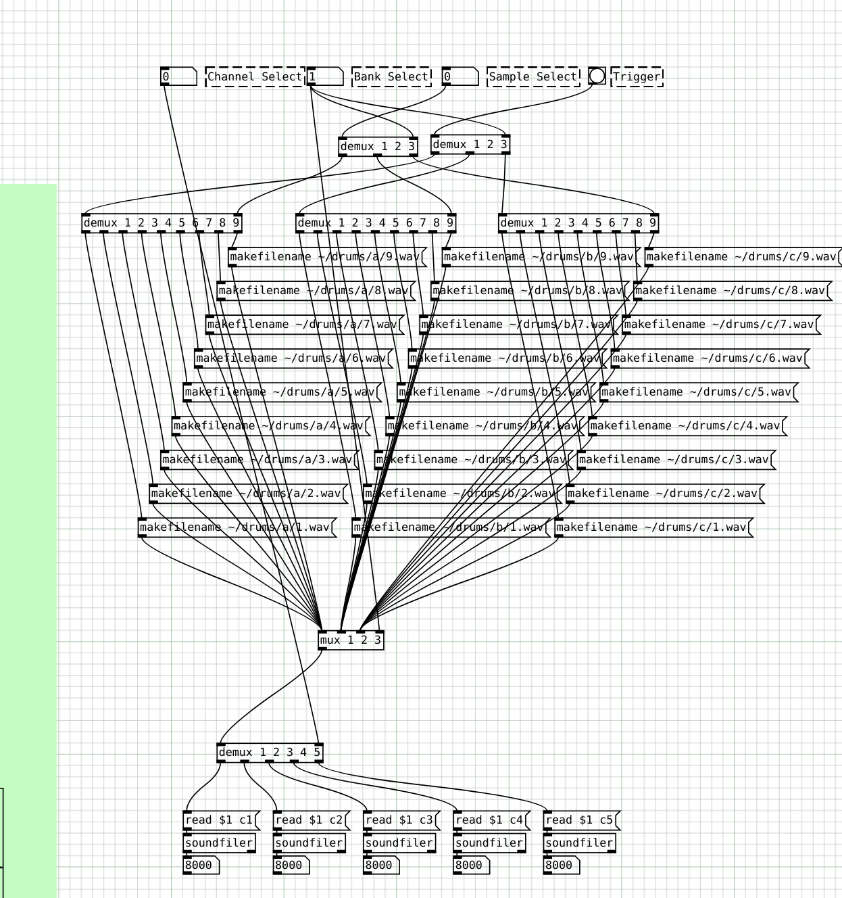

# Vega Carlson - Group 165 - Spring '22, Week 1

## Saturday, Jan 15th -- W:0.0 T:0.0

**0.0 hr** -- No Progress today

## Sunday, Jan 16th -- W:0.0 T:0.0

**0.0hrs** -- No Progress today

## Monday, Jan 17th -- W:0.5 T:0.5

**0.0hr** - No progress today - MLK day

## Tuesday, Jan 18th -- W:0.5 T:0.5

**0.5hr** - Met with the group to quickly recap where were at and do some organizational planning, as well as oggle our new PCBs and check them over real quick.

## Wednesday, Jan 19th -- W:0.5 T:0.5

**0.0hr** - No progress today

## Thursday, Jan 20th -- W:0.5 T:0.5

**0.0hr** - no progress today

## Friday, Jan 21st -- W:3.5 T:3.5

**3.0hr** - Soldered the 3x10 keyboard to a 32u4 and flashed it with QMK firmware. I'm not currently happy with the soldering job, and I have yet to get the LED matrix in place, but at least every button registers and it can *technically* be used now

---

**Week ending 1/21 total = **3.5 hours

---

# Vega Carlson - Group 165 - Spring '22, Week 2

## Saturday, Jan 22nd -- W:0.0 T:3.5

**0.0 hr** -- No Progress today

## Sunday, Jan 23rd -- W:0.6 T:4.1

**0.6hrs** -- Meeting with group

## Monday, Jan 24th -- W:0.6 T:4.1

**0.0hr** - No progress today

## Tuesday, Jan 25th -- W:2.8 T:6.3

**2.2hr** - SSH'd into the pi (After fixing some annoying issues with networking, which ate some time) and ran a `sudo apt-get update` and `sudo apt-get upgrade`. Following that, I got the dev environment working again, and then went to work on code. With the fresh eyes of after-break, I was quickly able to spot some bugs and now there's reliable triggering of the digital drums following the sequence. Still a long way to go, but it's looking good, plus flipping steps live with the keyboard is working now as well, albeit it feels a tad sluggish, as it takes a long time to register button presses. I think I'll be able to remedy this once I'm running the custom keyboard firmware for real, but before I do that I need to re-do the soldering job from last week (I used far to thick of wires, which doesn't leave room for the LED matrix) and add the LED matrix. I'd rather focus on code for now though

## Wednesday, Jan 26th -- W:4.4 T:7.9

**0.5hr** - Meeting. See minutes.

**1.1hr** - Worked on RP2040 main boards

## Thursday, Jan 27th -- W:4.6 T:8.1

**0.2hr** - Talked with group about the structure of the effects bus system to make sure everyone was on the same page

## Friday, Jan 28th -- W:8.2 T:11.7

**0.6hr** - Meeting, see minutes

**2.1hr** - KiCad work on RP2040 / Mixer board. This was restarted from Wednesday, using the existing KiCad file Mark tossed me, as with that I can be certain the parts can be obtained, via Mark if all else fails. Doing some digging into the RP2040, mixers, buffers, etc. to make sure things are reasonable. I did discover the rp2040 only has 2, multiplex, i2c ports, which should be fine, I'll just have to loop through and turn on/off the particular pins I want associated with each port and drop the data that way. I should still be able to do this at high enough rate. Board is coming along:

**0.9hr** - Code + work in purr-data to try to get multiple drum tracks working. I can get two tracks working, but when they both try to play at once I only hear one. I need to investigate further.

---

**Week ending 1/21 = **8.0 hours, **total** = 11.7 hours

# Vega Carlson - Group 165 - Spring '22, Week 3

## Saturday, Jan 29th -- W:0.0 T:11.7

**0.0 hr** -- No Progress today

## Sunday, Jan 30th -- W:0.0 T:11.7

**0.0hrs** -- No Progress today

## Monday, Feb 1st -- W:0.9 T:12.6

**0.9hr** - Started work on product spec

## Tuesday, Feb 2nd -- W:0.9 T:12.6

**0.0hr** - No Progress today

## Wednesday, Feb 3rd -- W:1.4 T:13.1

**0.5hr** - Meeting. See minutes.

## Thursday, Feb 4th -- W:5.7 T:17.4

**1.1hr** - Continued work on Product spec

**1.5hr** - PD work. I decided to re-start with [someone's existing patch](https://patchstorage.com/bjorns-mixer/), as I was having annoying issuses with my sample playback patch with ocassional clicks. This will need credit in the project, but it is MIT licenced. I also found [This patch](https://patchstorage.com/load-folder/) which might help with the mess of needing to switch between samples later. Then went on to try playing things back with the pi and python script again, and something is definitely weird - it works fine when triggered with a hardware MIDI controller from my desktop, yet despite the code seemingly being logically correct the same MIDI output channel is being used by all 5 sequencer tracks? Will need to spend time debugging.

**1.7hr** - Found the bug- python sometimes has issues with reording instructions, espically those from libraries. A message was being sent before it had the channel information actually associated with it, so I just packed that channel info in sooner and voilà, it's working. Now I need to expand the patch, make it pitch and velocity sensative, add effects, and step lock those effects, but this is an actually functional sequencer! It's truly palying back the programmed in steps and working! Then got to work on the PD patch again, took more work than it should have, but I have pitch and velocity input working again.

## Friday, Feb 5th -- W: T:

**0.5hr** - Meeting, see minutes

**1.5hr** - More work in Purr-Data. I made a sample selection patch that, while does work, feels a lot like when a beginner programmer uses a ton of `if`s because they don't know about `for`. Still, it works when tested with an external sequencer.

**.3hr** - Made a little start up script for the pi and tested the new patch on the pi. Script works, updated patch doesn't. Fortunately I *think* I know why, but I can deal with that next week.

---

**Week ending 1/21 = **8.0 hours, **total** = 19.7 hours
