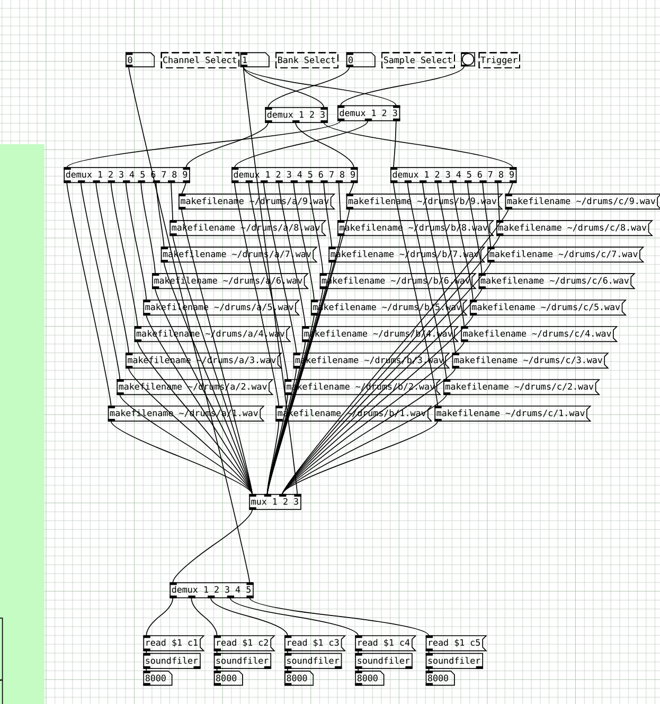
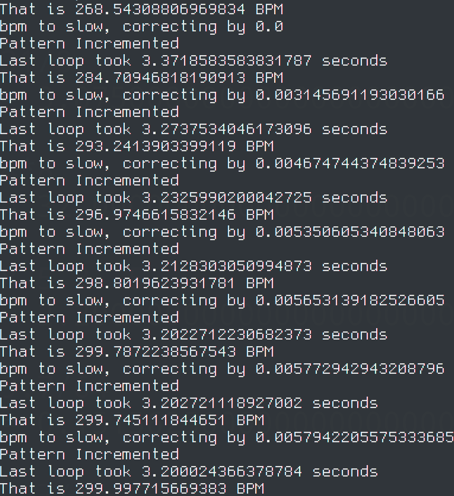

# Vega Carlson - Group 165 - Spring '22, Week 1

## Saturday, Jan 15th -- W:0.0 T:0.0

**0.0 hr** -- No Progress today

## Sunday, Jan 16th -- W:0.0 T:0.0

**0.0hrs** -- No Progress today

## Monday, Jan 17th -- W:0.5 T:0.5

**0.0hr** - No progress today - MLK day

## Tuesday, Jan 18th -- W:0.5 T:0.5

**0.5hr** - Met with the group to quickly recap where were at and do some organizational planning, as well as oggle our new PCBs and check them over real quick.

## Wednesday, Jan 19th -- W:0.5 T:0.5

**0.0hr** - No progress today

## Thursday, Jan 20th -- W:0.5 T:0.5

**0.0hr** - no progress today

## Friday, Jan 21st -- W:3.5 T:3.5

**3.0hr** - Soldered the 3x10 keyboard to a 32u4 and flashed it with QMK firmware. I'm not currently happy with the soldering job, and I have yet to get the LED matrix in place, but at least every button registers and it can *technically* be used now

---

**Week ending 1/21 total = **3.5 hours

---

# Vega Carlson - Group 165 - Spring '22, Week 2

## Saturday, Jan 22nd -- W:0.0 T:3.5

**0.0 hr** -- No Progress today

## Sunday, Jan 23rd -- W:0.6 T:4.1

**0.6hrs** -- Meeting with group

## Monday, Jan 24th -- W:0.6 T:4.1

**0.0hr** - No progress today

## Tuesday, Jan 25th -- W:2.8 T:6.3

**2.2hr** - SSH'd into the pi (After fixing some annoying issues with networking, which ate some time) and ran a `sudo apt-get update` and `sudo apt-get upgrade`. Following that, I got the dev environment working again, and then went to work on code. With the fresh eyes of after-break, I was quickly able to spot some bugs and now there's reliable triggering of the digital drums following the sequence. Still a long way to go, but it's looking good, plus flipping steps live with the keyboard is working now as well, albeit it feels a tad sluggish, as it takes a long time to register button presses. I think I'll be able to remedy this once I'm running the custom keyboard firmware for real, but before I do that I need to re-do the soldering job from last week (I used far to thick of wires, which doesn't leave room for the LED matrix) and add the LED matrix. I'd rather focus on code for now though

## Wednesday, Jan 26th -- W:4.4 T:7.9

**0.5hr** - Meeting. See minutes.

**1.1hr** - Worked on RP2040 main boards

## Thursday, Jan 27th -- W:4.6 T:8.1

**0.2hr** - Talked with group about the structure of the effects bus system to make sure everyone was on the same page

## Friday, Jan 28th -- W:8.2 T:11.7

**0.6hr** - Meeting, see minutes

**2.1hr** - KiCad work on RP2040 / Mixer board. This was restarted from Wednesday, using the existing KiCad file Mark tossed me, as with that I can be certain the parts can be obtained, via Mark if all else fails. Doing some digging into the RP2040, mixers, buffers, etc. to make sure things are reasonable. I did discover the rp2040 only has 2, multiplex, i2c ports, which should be fine, I'll just have to loop through and turn on/off the particular pins I want associated with each port and drop the data that way. I should still be able to do this at high enough rate. Board is coming along:


**0.9hr** - Code + work in purr-data to try to get multiple drum tracks working. I can get two tracks working, but when they both try to play at once I only hear one. I need to investigate further.

---

**Week ending 1/21 = **8.0 hours, **total** = 11.7 hours

# Vega Carlson - Group 165 - Spring '22, Week 3

## Saturday, Jan 29th -- W:0.0 T:11.7

**0.0 hr** -- No Progress today

## Sunday, Jan 30th -- W:0.0 T:11.7

**0.0hrs** -- No Progress today

## Monday, Jan 31st -- W:0.9 T:12.6

**0.9hr** - Started work on product spec

## Tuesday, Feb 1st -- W:0.9 T:12.6

**0.0hr** - No Progress today

## Wednesday, Feb 2nd -- W:1.4 T:13.1

**0.5hr** - Meeting. See minutes.

## Thursday, Feb 3rd -- W:5.7 T:17.4

**1.1hr** - Continued work on Product spec

**1.5hr** - PD work. I decided to re-start with [someone's existing patch](https://patchstorage.com/bjorns-mixer/), as I was having annoying issuses with my sample playback patch with ocassional clicks. This will need credit in the project, but it is MIT licenced. I also found [This patch](https://patchstorage.com/load-folder/) which might help with the mess of needing to switch between samples later. Then went on to try playing things back with the pi and python script again, and something is definitely weird - it works fine when triggered with a hardware MIDI controller from my desktop, yet despite the code seemingly being logically correct the same MIDI output channel is being used by all 5 sequencer tracks? Will need to spend time debugging.

**1.7hr** - Found the bug- python sometimes has issues with reording instructions, espically those from libraries. A message was being sent before it had the channel information actually associated with it, so I just packed that channel info in sooner and voilà, it's working. Now I need to expand the patch, make it pitch and velocity sensative, add effects, and step lock those effects, but this is an actually functional sequencer! It's truly palying back the programmed in steps and working! Then got to work on the PD patch again, took more work than it should have, but I have pitch and velocity input working again.

## Friday, Feb 4th -- W:8.0 T:19.7

**0.5hr** - Meeting, see minutes

**1.5hr** - More work in Purr-Data. I made a sample selection patch that, while does work, feels a lot like when a beginner programmer uses a ton of `if`s because they don't know about `for`. Still, it works when tested with an external sequencer.



**.3hr** - Made a little start up script for the pi and tested the new patch on the pi. Script works, updated patch doesn't. Fortunately I *think* I know why, but I can deal with that next week.

---

**Week ending 2/05 = **8.0 hours, **total** = 19.7 hours

# Vega Carlson - Group 165 - Spring '22, Week 4

## Saturday, Feb 5th -- W0.0 T:19.7

**0.0 hr** -- No Progress today

## Sunday, Feb 6th -- W:0.0 T:19.7

**0.0hrs** -- No Progress today

## Monday, Feb 7th -- W:0.0 T:19.7

**0.0hrs** -- No Progress today

## Tuesday, Feb 8th -- W:0.0 T:19.7

**0.0hr** - No Progress today

## Wednesday, Feb 9th -- W:0.5 T:20.2

**0.5hr** - Meeting. See minutes.

## Thursday, Feb 10th -- W:5.3 T:25.5

**4.9hr**- First up, when I left off last week the PD script worked on my desktop, but didn't output sound on the pi, so I went to trace that down first. After more debugging than I care to admit, only to discover that I had a master low pass filter set to a cut off of 0Hz, and sample play back is working. It's not the most spectacular thing yet, but it works

Then I needed to work on the UI a bit. I've found having the overview of each pattern's steps is actually hugely helpful, and I think will remain so even when we get the LEDs in the keyboard, so I set up a toggle between the two views. While doing UI, I decided to impliment the pattern lock toggle as well, and then went for getting BPM control, as it was the next biggest thing on the UI... however...

BPM control is going to be a massive problem. Even without any delay/sleeping/etc. the max BPM as-is (without actually measuring anything) feels like 60-ish, which is way to slow. So, I'll need to see how I can shave cycles or thread some things, otherwise this is only going to get worse. 

As a quick & hacky solution, I'm going to try using cython (python → c) to see if it gives me a good performance bump... it doesn't.

```
cython -3 --embed main.py
mv main.c test.c
gcc -O3 -o test test.c `pkg-config --cflags --libs python3`
```

... trying `pypy3` instead. Reading, it should, but it should also hurt startup time, that is assuming it works at all.

... it isn't working. Something weird is happening with pypy and numpy, and I can only assume that numpy is being used by one of the other libraries I'm using, as I'm not directly and pypy otherwise works fine. Heck. I have numpy reinstalling (awkwardly slowly? I think runnin gpip made it completely recompile?) in the hope that will work. Otherwise my best bet is a pi-4, which is un-obtainium right now.

I did notice that I'm currently on a 32-bit kernel, but I'm not even going to see if switching to 64 bit helps at all, given the pretty low impact it seems to make: https://www.sevarg.net/2021/12/18/raspberry-pi-32-bit-vs-64-bit/

It *might* be practical to do the re-write in C++, but that'd be pushing my C++ skills, and I'd still need to interface with the 2 display hats - both of which only have python libraries available -  **and** I'd have to re-solve a bunch of other issuses, so I don't think there's time.

Okay, after more reading, it appears that pypy doesn't use the normal library install location. This requires some awkwards workarounds, but I think I can make it all work. I basically just have to get every library I'm using... and all of their dependencies, re-installed.  I'm starting to regret my choice of working in python now....

Yeah, nope. Numpy and pypy aren't going to get along, which rules out one of my libraries right away, and I haven't even tried to fix the others. I think my only option is to optimize the normaly cython implimention and my code as best I can.

I tried converting the code to work with cython, adding type hints and what not, but the performance gains weren't steller. I also tried profiling with python's `cProfile` and nothing stood out. Othen than throwing a pi-4 at the problem, I'm pretty much out of ideas. Today was highly frustrating.

Did some quick digging into the Unicorn and Microdot Phat's python source. In theory adapting to C(++) if that's the only option should be doable, but I'd still much rather not.

## Friday, Feb 11th -- W:8.0 T:28.2

**0.5hr** - Meeting. See minutes.

**2.2hr** - Switched over to the pi-4 to test if it'll save my bacon, that required some re-setup. It's definitely faster, but still not up to 120BPM, which is my target (as that's what most drum machines default to). It's currently at ~100BPM though, so significantly better. Doing some work to see if I can find what in the code is eating all the cycles, added a timing function for better anysis.

Then did some reading and discovered that python threading library [may not have actually been helping me any,](https://stackoverflow.com/questions/6821477/python-code-performance-decreases-with-threading) so switched over to the `multiprocessing` library (ughh.) ... and it appears the overhead actually makes things worse. Go figure.

| Change                                     | BPM (roughly) |      |
| ------------------------------------------ | ------------- | ---- |
| No multithreading (Baseline)               | 98.25         |      |
| Multi*processing* the display updates      | 92.5          |      |
| No display call (Obviously not a solution) | 50,000+       |      |

---

... huh. well, I was intending to do more testing but that's pretty conclusive about where the problem lies, even if I don't have a fix yet.

... and it's fixed. Turns out `uh.show()`, the function which wrote to the RGB LED matrix, was being called *way* to much and eating everything. I might even be able to switch back to the pi-3 fine. I then brought back in the other display and rounded things off by adding code that effectively acts as as PI, but the results are good- in this image the target is 300 BPM



Switching back to the pi-3, now, since it appears the pi-4 wasn't needed after all, and yep, all good.

Decided to end the night with some code clean up, and then some (off the clock) work to make it easier to navigate and do some show-boating.

**Week ending 2/11 = **8.0 hours, **total** = 28.2 hours

---

# Vega Carlson - Group 165 - Spring '22, Week 5

## Saturday, Feb 12th -- W0.0 T:28.2

**0.0 hr** -- No Progress today

## Sunday, Feb 13th -- W:0.0 T:28.2

**0.0hrs** -- No Progress today

## Monday, Feb 14th -- W:0.8 T:29.0

**0.8hrs** -- Worked with Reid in the lab debugging the FM drum and spent a fair amount of time talking with Cole about organizational stuff.

## Tuesday, Feb 15th -- W:0.8 T:29.0

**0.0hrs** -- No Progress today

## Wednesday, Feb 16th -- W:1.3 T:29.5

**0.5hr** - Meeting. See minutes.

## Thursday, Feb 17th -- W:4.1 T:32.3

**0.8hr** - Continued work on the RP2040 controller board

**0.8hr** - Made Reid some DIY vactrols. Tried to test them, but something is being weird.

**1.2hr** -  Got to the pi for a bit, started with an apt-get update and upgrade (I like to keep things on my network up to date) then started thinking about how to do the per-step values. This is kind of a mess in terms of the object orientation. If I make the steps be the 'parent' of the drums, it implies that each step in the same track can change the drum, which isn't right. If I make it to the track, it's awkward to convey that each step should be able to hold value. I might be able to make the steps children of the drums, which is more logical, but that's still a bit awkward. I think no matter what it's a nasty refactor, so that sounds like the best call, so I've started that. ... okay, some more work in and I've actually decided to to remove the track class entirely and just wrap it into the drum. I (think?) I have the refactor done to the point where everything works as before, so now I just need to start bolting the new functionality on that this refactor was done for.

## Friday, Feb 18th -- W:8.0 T:36.2

**0.5hr** - Meeting. See minutes.

**2.4hr** i- Continued work on the refactor and getting per-step data

~~Updated to python 3.10 on the pi (I wanted to use some new features)~~ This was going to be a pain due to libraries, so while it's installed, I'm not going to use it unless I actually have to.

While I was at it, I went through and did some work to make the code a bit more consistant with python's naming conventions, and it did actually significantly help with readability

Finally finished up the refactor and now each microstep hold data about each drum's parameters. The code is much more sensible now, and I'm quite happy with it.

**1.0hr** - 
