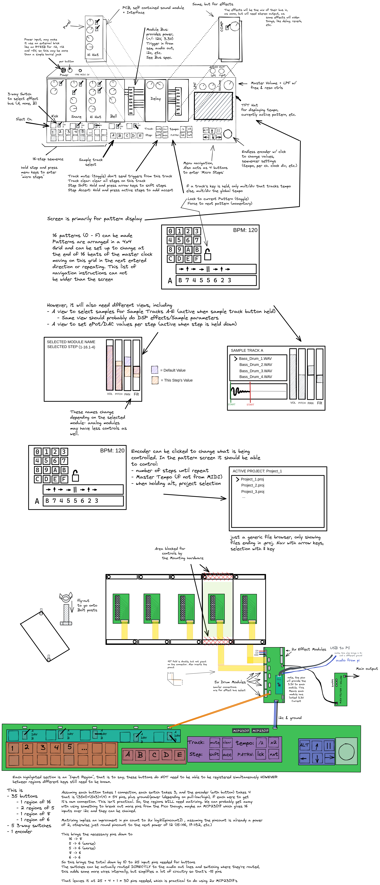

# Product Spec Revision 3 - Sep 19th 2021

---

A few notes

- While we wanted to go with an OLED or Eink display initally, it seems that may require more work when it comes to the software side of the project, and the project is already big as is. So, instead [an off the shelf pi TFT hat](https://www.sparkfun.com/products/17520) is looking like a much better option. 
- **NOTHING** above is to scale, as dimensions are still largely up in the air

