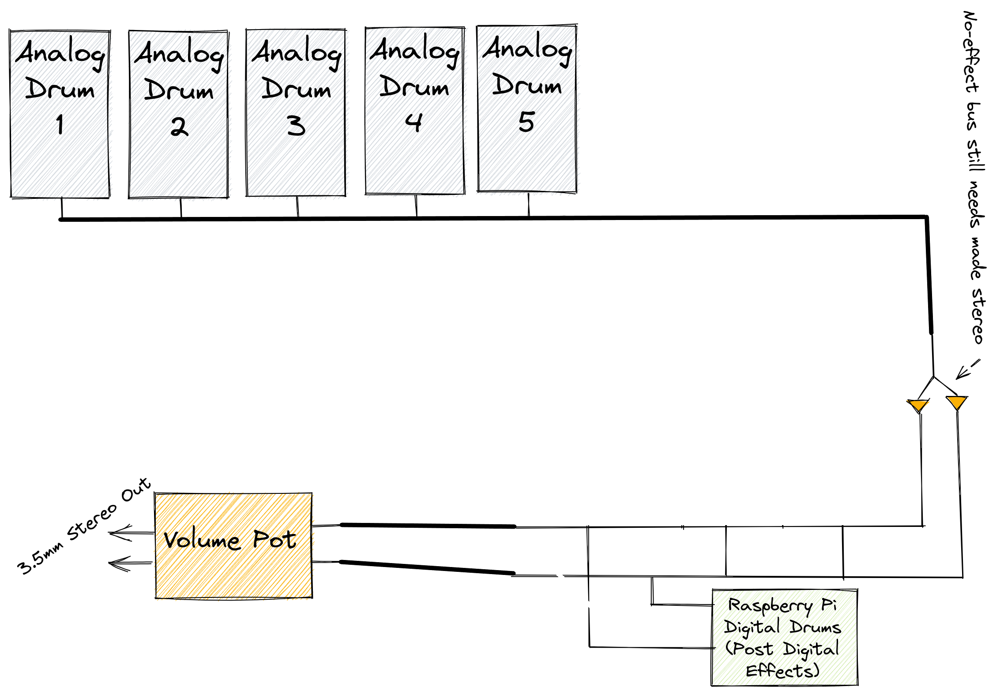

# G165 - Project Spec, Rev. 7 (Updated 05/05/22)

Overview:

At a high level, the goal of the project is to make a self-contained (excluding speaker), hybrid (analog and digital), drum machine with an inbuilt sequencer and digital effects.

Both for the ease of development and as a feature, the **analog drums** are designed as modules which may be rearranged or replaced outright. This allows for added flexibility as the drum machine can be configured in otherwise a-typical ways, such as making all the drums be the same bass drum (if enough of the same module were available). Some of these analog drums have added **digipots**, which allow for parameters of an analog drum to be varied per-step.

The **digital drums** on the other hand are samples played back with in the Purr-Data (PD) visual programming environment. This allows for extreme flexibility, and low overhead as PD is quite efficient yet allows for the creation of custom effects- speaking of, each digital drum will have a few built-in effects: Reverb, Delay, and Distortion. Purr-Data runs on the **Raspberry pi 3b+** at the heart of the project.

Along with PD, the pi also running a python script which injects data from two connected keyboards running QMK firmware, which allows for the entry of the drum sequence, selecting channel, setting the tempo, etc. This information is then displayed on two pi-phats, one 7x17 RGB led matrix and one led-dot character display.

For the analog drums, the information about when to trigger and what values to send to the digipots is sent over USB to a **custom RP2040 based board**.

The output from the analog drums and the pi running the digital drums is then mixed and the volume can for digital and analog drums can be changed to ensure everything can be heard via a 3.5mm jack. 

# The Analog Drums

Each analog drum communicates with the controller board with the RP2040, receiving triggers at 3.3V and i2c data (3.3V logic) for the digipots and sending a mono audio signal out. The controller board also passes each drum a ground, +5V, +12V low pass filter, and -12V connection for power. There is also a pin for detecting if a module is actually installed in a given slot.

This is all sent over a 2x12 2.5mm header connection, where the rows are duplicated. This header also contains the audio in and a second audio out so that the same header may be used for the effect modules.

| Audio Out Left | Audio Out Right | Audio In | Ground | +12V | -12V | Ground | 5V   | Detect | i2c SDA | i2c SDL | Trigger |
| -------------- | --------------- | -------- | ------ | ---- | ---- | ------ | ---- | ------ | ------- | ------- | ------- |
| Audio Out Left | Audio Out Right | Audio In | Ground | +12V | -12V | Ground | 5V   | Detect | i2c SDA | i2c SDL | Trigger |

It should be noted that this connector is **not** reversible, and doing so will damage the device. Also, some of the drums experienced issues near the end. Had there been more time, the drums could have been reworked. 

### Bass Drum & Toms

The Bass Drum and Tom drums are based on the TR-808 drum machine's bridged T oscilallators, and output a decaying sine wave with some varience in frequency as it decays. The Tom circuit was constructed with an analog multiplexer for selecting between three pitches, a high, mid, and low tom sound. The analog multiplexer has its select bits set via an i2c io expander on the board, sharing the i2c connection of the digipots also on the board.

### Hi-Hat

The hi-hat module is essentially a sine wave mixed with noise again.

### Snare

The Snare is heavily based on the Korg KR55 drum machine's snare circuit, and produces a decaying sine wave mixed with noise which closely resembles the sound of a real snare drum.

### FM & Drone

The FM Drum and Drone modules are based on the infamous "Atari Punk Console" circuit, often called just APC, which uses two 555 timers. The 555 timers are actually 551 timers, which are less noise-sensitive. This will hopefully help when we attempt to mix the drums because the FM will not produce as much excess noise. For both the FM and Drone modules the circuit was duplicated such that one of the APC sub-circuits modulates the other's pitch. This creates a very noisy but still pitched waveform. This is then passed through a low pass gate (LPG) so that they may respond to triggers. For the FM drum, this LPG is normally closed and only opens on trigger, while for the Drone the opposite is true, allowing it to drone on and instead be muted temporarily when a trigger is received.

**Note: The Drone may not be included in the final design (time dependent)**

## The Digital Drums

The digital drums, as previously mentioned, are all played back via the Purr-Data visual programming environment. In Purr-Data a bank of drum samples is selected from per each channel, effects are applied to each drum, and the all the digital drum outputs are mixed. A work in progress of this Purr-Data "patch" is shown below:

While some of these parameters will be exposed to the user interface, this environment will not typically be shown to the end user. Fortunately, the patches are easily modified by either replacing the file on the SD card or by running the patch in an SSH session with X11 forwarding .

## The Sequencer & User Interface

### Step Sequencing

The step sequencer is the core of the drum machine, as the boolean values set at each step determine weather on not to play a note at that instant in time. Traditionally, drum sequencers will run on 16 steps per drum (or track). While this is mostly-true of the sequencer in this project, it is further complicated by the ability to divide each step into 4 smaller "micro steps". These micro steps are less convenient to enter - requiring the user to be on the right track, hold down the step's button, and then press the desired micro-step buttons - but have the effect of allowing for either interesting drum patterns at higher rate (such as ratchets) or, if the project tempo is slow, effectively extending each pattern into a 64 step sequence. 

### Pattern Sequencing

Repeating the same 16 (or 64, depending on how you look at it) step sequence on repeat quickly becomes repetitive. To remedy this, sequences can be stored into and recalled from "patterns". This then leaves the sorta of meta-problem of sequencing these patterns into song or track. As an less-than-original spin on this, this project uses the idea of "Euclidean Sequencing" which is really a fancy way of saying to place the patterns on a grid, and to wrap around if an edge is reached.

| 1    | 2    | 3    | 4    |
| ---- | ---- | ---- | ---- |
| 5    | 6    | 7    | 8    |
| 9    | 10   | 11   | 12   |
| 13   | 14   | 15   | 16   |

 For example, if pattern one is currently playing, and the last step is reached and the next pattern is "Right" then it would move to pattern 2. Then, if at the last step of pattern 2 the next step is to move "up" it would wrap around and play pattern 14. This necessitates 5 pattern instructions, repeat, up, down, left, and right. It's these instructions which are sequenced, not which pattern is played. Even a short sequence of only `up, right` starting at 1 would go `1->13->14->10->11->7->8->4->` before repeating. This allows for complex, seemingly generative song structures to emerge. Because not many steps are required to make a complex pattern, the pattern sequence is limited to 8 instructions. The pattern sequence can also be locked to the current pattern, necessary for looping a given pattern while entering its steps. An animated gif showing this process is below (static in the .PDF copy of this document)

### User Interface

## The Control Board

The control board consists of an RP2040 microcontroller to recieve information about the sequence from the pi over USB, inputs from the power supply, and many headers for connecting to each module to send and recieve signals. The board also works on these signals, doing the necessary mixing and routing.

### Mixer

## The Displays & Keyboard

The choice of displays may initally seem odd: working with two different LED matricies instead of just using a screen is counter-inutitive; however, there are multiple benefits. First, Vega was willing to pay for it; Second, they're bright and in a live use environment would be easy to see; and third, a good portion of the reason to buy physical music equipment is because the user doesn't want to look at a normal screen.

The choice in keyboards was mostly out of necessitity. The BDN9 macropad with it's two encoders and 7 buttons is realative inexpensive and avoided the need to design yet another board. Meanwhile, the choice to handwire a 3x10 keyboard was done because there was nothing that small that offered the required individually addressable LEDs for showing the current state of the steps.

## Power Supply

Power is supplied by a Meanwell RT65b, which provides ample current and the necessary +12,-12, and 5V rails to power the modules and Raspberry pi. The pico is powered from a 3.3V regulator that is fed via the 5V output of the power supply because it is a 3.3V logic device, which is why the i2c logic, detect inputs, and triggers are all 3.3V as well.

## Enclosure

The enclosure is built from acrylic. It was built in OpenSCAD and used a lasercutting library to convert a 3D model to six 2D pieces with notches similar to a puzzle piece. It is held together using an adhesive, and the drum modules are attached to smaller pieces or acrylic with a zip tie. Holes were drilled for the potentiometers, and an additional piece of acrylic is used to prevent the drum modules from falling into the box. 

