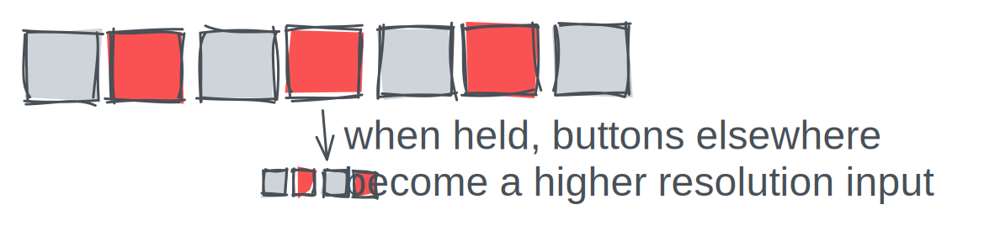
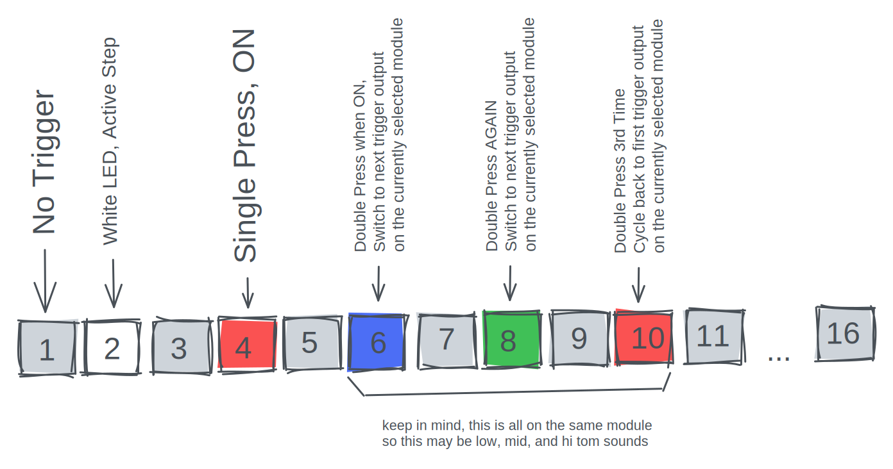

# Sequencer and Bus Selection

[WORK IN PROGRESS]

## Sequencer

The sequencer is really the 'brain' of the project, and as such will need a micro controller which handles the logic and user interface. The 'core' of the sequencer is the 16 step buttons, but there will still need to be a variety of things acomplished by the sequencer that necessitate extra inputs and outputs:

### Ideas

- Step Entry

  - Each step has it's obvious binary state

    - We'd also like to do 'micro steps' where holding a step lets the user enter in sub-divided steps

      

      This could be done in a variety of ways, currently the thinking is to use the arrow-keys that are normally used for menu navigation as the micro-step inputs when a step is held down

- Sound selection

  - Each module will have *Module Select* button- see the "Select & Mute" button in the main mockup design in `AnalongDrumMachineIdea.md`

  - Modules *may* be able to provide more than one sound, see the description of the Tom Drum module in `DrumSelection.md`, this also necessitates a way to change the selected sound. This gets complicated if we want to be able to change the sound on each micro-step as well. One option may be to make quick taps of the buttons cycle though the available triggers, shown via an RGB LED. This requires detecting double press events, which can be complicated with debouncing and may add to input latency (we need to wait on single press to ensure it's not a double press) but should be reasonable anyway.

    

    Keep in mind, each module has it's own dedicated select button. This double-tap action has the advantage of  making entry on the micro-steps work too. It could also be done such that a single-tap access sound 1, a double sound 2, and a tripple sound 3. This may incur even more latency though, as detecting a tripple-press would require a larger window to see if any given input is a tripple press.

- Pattern Selection 

  - If the drum machine can only loop the same 16-steps over and over it may get a bit bland, so a user will probably want to program in multiple patterns and be able to switch between them.

  - There may be a desire to have in currently *playing* pattern be seperate from the pattern being currently *edited*

  - It would be ideal if patterns could be chained (play pattern 1 twice, then play pattern 2 once, repeat)

  - Pattern/Sequnece storage may be a bit complicated by the fact that the modules may be changed around, should the pattern be 'blind' to this and just output trigger and let the user mix and match? This might be cool if the user makes a nice pattern and decides "I'd like to try swapping the snare and hat sequnces", for example

  - It would be good if patterns were persistant. We might want to write them out to an SD card. If the format is kept simple enough we may be able to make patterns computer editable, which would be nice, maybe the file  format could look something like this

    ```
    P1:
    1:1___|____|____|____|1___|____|____|1___|____|____|____|1___|____|____|____|____|(x1)
    2:1___|2___|3___|1111|____|____|____|____|____|____|____|____|____|____|____|____|(x2)
    3:____|____|____|____|____|____|____|____|____|____|____|____|____|____|____|____|(/4)
    4:____|____|____|____|____|____|____|____|____|____|____|____|____|____|____|____|(/2)
    5:____|____|____|____|____|____|____|____|____|____|____|____|____|____|____|____|(x1)
    6:____|____|____|____|____|____|____|____|____|____|____|____|____|____|____|____|(x1)
    P2:
    1: ...
    ```
    where each `____|` is a step and it's micro-steps, a `_` is no trigger, and a 1, 2, or 3 is what trigger to send on that channel on that step? The `(xn)` / `(/n)` would be for per-module tempo divison, see the next section.
    
    Writing a parser for this should be pretty easy, so that things could be loaded up on boot

- Tempo Entry & Division/Multiplication

  The encoder should probably default to changing the tempo, unless some other input where encoder input is a good choice is selected on the OLED.

  Each channel should also be able to be given a tempo, this way some tracks may be set to go by at 1/4, 1/2, normal, 2x, or 4x speed. At 2x for exmalple, the entire 16 step sequnece would play in the same time as 8-steps of 'normal timed' sequnce. Division is actually more complicated, as it may require transitioning to the next pattern when the divided sequnce hasn't finished playing yet, if there's a pattern chain setup.

### Components

The sequencer needs quite a few components

| General Component    | Purpose                                             | Part Choices                                             | Part Selection |
| -------------------- | --------------------------------------------------- | -------------------------------------------------------- | -------------- |
| Micro Controller (1) | "The Brain"                                         | pi Pico, Black Pill, Electrosmith Daisy, pi Zero + other |                |
| Screen (1)           | User interface- Tempo entry, pattern chaining, etc. | OLED, Eink, charliplexed LEDs                            |                |
| Encoder (1)          | Edit values on screen                               | Small clicky, small smooth, big optical                  |                |
| Buttons (~30)        | Step Entry, arrow keys, track select/mute           | Cherry MX Compatible                                     |                |
| RGB LEDs (~30)       | Under-button indicators                             | WS2812b or APA102c                                       |                |
|                      |                                                     |                                                          |                |
|                      |                                                     |                                                          |                |
|                      |                                                     |                                                          |                |
|                      |                                                     |                                                          |                |

#### Micro Controller

| Choice          | Pros                                                         | Cons                                                         |
| --------------- | ------------------------------------------------------------ | ------------------------------------------------------------ |
| Pi Pico         | PIOs may be useful for timing, detecting double/tripple button presses, interfacing with RGB Leds, etc. Dual Core | New, lacks support                                           |
| Black Pill      | USB-C, more libraries and documention than Pico (older)      | Not as fast as pico                                          |
| Daisy           | Onboard DSP, much more powerful                              | expensive, DSP may not be useful                             |
| pi (or any SBC) | Lots of power- could do good looking graphics, could load existing software MIDI sequencers and make the majority of the sequencer just interact as a MIDI controller. USB MIDI adapter circuits could be used to get the tempo, external controllers could be connected via USB. Programming can be done is higher level langugages, allowing for rapid development of more interesting sequencing systems | Expensive (comparitevly), high power draw, would still need other micro controllers for real time actions. Slow boot time. Potential latency issues going from the micro driving the sequncer, into the pi, out another micro to send triggers. Harder to ensure real time operation. |


Using an SBC, probably a pi3b+ or pi4, seems like the best solution here as it will alleviate the issues that come with trying to do so many things - clock input, UI (buttons/encoders), display, output triggers, etc - in real time. Furthermore, the pi will be able to function as a audio sample output source using its built in audio output. This removes the cost of the sample based drum module and lets the UI for that module be much better. The biggest issues we foresee are high draw on the 5V rail to power the pi and noise coming from grounding- USB is nutritiously noisy, and this is likely how the sequencer MIDI input would be connected- via a sperate micro controller attached via USB. We will likely need to research using a linux-rt kernal on the ARM processor of the pi, as well as see what can be done to reduce boot time - possibly by disabling kernal modules.

Using the audio out of the pi to replace the sample drum module slot-in changes our design in some more dramatic ways though and will likely necessitate a redesign of the initial mockup to accommodate more hardware buttons for the sake of selecting these sample channels. There's also a design choice of routing the left and right channels as individual mono channels that can then be sent along the effects bus or removing the sample based drums from the analog effect bus entirely and chaining the project to be more of a hybrid drum machine, with the sample based sounds being ran though their own DSP effects. The prior is more in line with the initial design, while the latter has the advantage of supporting stereo sample playback- useful both for actual stereo samples and for simple panning - as well as letting each sample track have its own effects, including those that are better served by DSP, such as reverb.

There's also the option of using the pi as a mixer, taking the analog mix from the output of the summed effects channels from the analog drums and running it into a stereo audio input codec attached to the pi, so that DSP effects can be ran on the pi and then the sample drums simply mixed with this signal. This adds an ADC->DAC step at the end of an otherwise all analog audio signal chain though, which seems to defeat the purpose of the entire project a bit - if we do that, we may as well have made a digital drum machine to start.

Using the pi also gives us the advantage of being able to use higher level programming languages, namely python and pure data, to define the function of the sequencer and any internal effects on the sounds. This also means that this could be exposed as a feature, being within the realm of an advanced user wanting to customize their experience. The [mididings](http://das.nasophon.de/mididings/) and [python-midi](https://github.com/vishnubob/python-midi) python libraries look particularly promising 

As for the μC that will handle the buttons and leds, either a 32u4 or blackpill board seems reasonable- both because they already have existing support for MIDI - I (Vega) have experience with the 32u4 as a MIDI controller using the  [Arduino MIDI USB Library](https://www.arduino.cc/en/Reference/MIDIUSB) but have found that on the 32u4 it's easy to overwhelm the resources of the controller. The blackpill could run [opendeck](https://github.com/shanteacontrols/OpenDeck) which doesn't fully remove our need to code as some of the more advanced features we want will require some modification of the code, especially if we'd like to support double or triple button presses. The black pill does have support for the Arduino framework, so *in theory* the Arduino MIDI USB library should work; however, because implementing the MIDI protocol ourselves has such high potential to be a massive foot-gun it would be best to ensure this is the case first. If it does, then the Blackpill is an obvious choice as it gives us a backup in case whichever method we chose to use first doesn't work out.

----

Researched the Black Pill (STM32F411) & Pi Pico (RP2040) to see how their development chain looks & feels, with a particular focus on MIDI over USB libraries as implimenting from that from scratch would be a massive pain. Starting with the pico running circuitPython, as while there seem to be some raw-C implimentions of MIDI over USB on the pico, there's really no reason not to use circuitPython and ease development if we can.

The Pi-Pico just works with CircuitPython. Using [This](https://blog.4dcu.be/diy/2021/05/20/MIDIpad.html) as example code and it's already functioning. Obviously we'd still have to write all the logic for the sequencer, but this is looking very promising. **however,** using circuitPython limits  us to only using one of the two cores on the pico. If necessary we might be able to get microPython working, which does support threading, and use [this hopefully still functional](https://github.com/cjbarnes18/micropython-midi) library. Another option is to do as that library recommends and just shoot data down the serial port and convert it to midi on the full-size pi we'll have in the project too; however, that is less than idea as class compliance just generally makes everything a bit easier. Using circuit python can also be seen as a feature for the end user too, as it means the function of the micro controller itself is end-user programmable, which for some things may be usefull- for example a user might want to adjust the timing for debouncing (to enable faster triple-pres inputs) or add some weird feature like a "trigger all" channel

On the blue/black pill, the libopencm3 RTOS is an option and does provide a USB-MIDI library. Other options include the [USBComposite](https://github.com/arpruss/USBComposite_stm32f1) arduino library for STM32F1(bluepill) devices. For the Blackpill (F411, not the F401), it does appear it's possible to use microPython (not circuitPython) and a midi library. There's also [MBED](https://os.mbed.com/cookbook/USBMIDI) which has a [USB-MIDI](https://os.mbed.com/docs/mbed-os/v6.14/apis/usbmidi.html) library. I have some prior experience with mbed- the biggest feature for us would be its [Event handeling](https://os.mbed.com/docs/mbed-os/v6.14/apis/scheduling-rtos-and-event-handling.html) systems, which would make setting up a sequencer pretty easy. All of these are reasonable options should we not be able to use the pico, but until we have reason not to I don't see reason to explore them further as the pico really does appear to be the best option.

Finally, boards using 32u4 which works with the normal Arduino midi library remains an option, albeit one I have had experience with in the past where the μC was dramatically under powered.

## Bus Thinking

There are actually *two* busses, one for sound sources and one for effects

### Sound Sources

Sound source modules need a variety of I/O

- Trigger input(s)

  - These will be very sensative to latency and timing. If two drums are to be triggered at the same time, more than a milli-second or two may alter the phasing relationship between the sounds. This may be fine so long as the latency is consistant, but it's best to keep it low
  - Different module refrence designs may want different trigger voltages and lengths. Because of this, levels may need shifted. It is probably easier to lengthn a pulse than shorten it, so the trigger coming from the sequncer will be kept as impulse-like as possible

- Sound output

  - Each module will only have a single mono output. If the module can make multiple sounds, they'll need to be mixed (even if only one can ever be played at once) into this single output

- Power

  - Modules will likely need opamps that, ideally, would be given a clean +12V and -12V rail
    - This may need filtered per-module, espically if that module produces a weird load that may interfere with other modules- this is a known issue with many designs using the 555
  - Either 5V or 3.3V would also be nice, as it would be ideal to have something that matches our trigger source and which can be used to power micro controllers easily without needing a seperate low voltage regulator on every module. This probably depends on the logic level of the micro controller or if the μC chosen has 5V tollerent I/O
  - Ground, obviously, is required. We may want to have seperate analog and and digital grounds, but more research into this is needed

- Identifier

  This could be done in two ways: The cheap & easy way, or the complicated and expandable way

  * Cheap & Easy is to reserve some of the pins to be bits that indicate a module ID, if those pins are tied high, that's a 1, low, 0. This is sub optimal as it uses a lot of pins, limits future expandability, and prevents the modules from holding more data that could be communicated to the main controller such as a version number.
  * The other way to do it would be to add an i2c bus or similar. A simple i2c eeprom would do this quite well and doesn't drastically add to the BOM. We might also just use a low cost μC acting as an I2C slave if we need additional logic on the module as well, as the cost of external logic could then be bundled into the single IC
  
  ### Effects Bus
  
  * Audio input
    * Each effect module will need a summing mixer that can compensate the gain depending on the number of modules attached, in order to keep the signal's Vpp similar regardless of the number of modules on the bus
  * Audio output
    * All effect modules will need a stereo output.
      * Ideally, for all effect modules something could be done to add a real stereo effect- even if it means just duplicating the effects circuitry. For example, with a distortion/fuzz we may use two identical circuits under the assumption the the non-lineraties and added noise would varry slightly per channel, giving at least some stereo field.
      * If the module is already nearly the maximum that can fit on the board though, we may just need to duplicate the signal such that the left and right outputs are identical
      * Another option would be adding a very slight delay to one side, in order to add subtle stereo width. This circuit could work if duplicating the effect isn't possible, but there is more room than require for just the simple equal channel case
  * Power
    * This should be the same as the sound source case - +12, -12, and +5 (or 3.3V)
    * Effects may draw more power, as tubes, DSP effects, etc. are all a bit more power hungry than the simple analog circuits of the drum modules. We'll need to keep this in mind when selecting a power supply
  * Identiyer
    * Should be the same as sound source modules

---

## Bus Selection

After talking with Mark a bit more, we're still unsure if we'd like to use digital potentiometers for some of the drum settings, allowing for more complex sequencing of parameters. Fortunately, most digipots run over i2c, so if we use that for the identifier we can just use it for digipots too. Basically, by at least running i2c to each module, the project is overall more flexible. It *may* be helpful to have a seperate i2c channel per module, but fortunately the pico can provide more than enough i2c channels to make this happen. This *might* require adding a second pico or just getting something to multiplex inputs so that we have enough gpio to hook up all the buttons/encorders/etc but neither option is hugely expensive or out of the question anyway.

This leaves the buses spec'd as such:

**Sound Sources:** 

* Trigger input (kept as impulse-y as possible)
* Sound output (Mono)
* Power (-12V, +12V, 3.3V, Ground)
* i2c
* Presence (just a short when a module is present)

Total = 9 pins

**Effect Modules:**

* Audio Input (Mono)
* Audio Output (Stereo)
* Power (-12V, +12V, 3.3V, Ground)
* i2c
* Presence (just a short when a module is present)

Total = 10 pins

### Bus Connector?

Keeping the physical bus connection the same between module types means needing at least 10 pins. It would also be nice to have each pin only serve one purpose, regardless if used as an effect or source, just leaving unused pins not connected. This brings the requirement up to 11 pins (1 for presence, 2 for i2c, 4 for power, 2 for audio out, 1 for trigger in, 1 for audio in), so any connector with at least 11 pins should be fine, though physical size constraints are still a consideration. For simplicity, we'd like to stick with the standard 2.54mm spacing. While not physically the strongest or most user friendly connection, using the normal 2.54mm headers and sockets (like Arduino/Pi shields/hats) is a reasonable option given the ease of development and low cost as we could just solder to protoboard.

## i2c parts?

We need some i2c eeproms, some i2c digipots, and some i2c DACs (MCP4725 seem common) to test with. The particular part doesn't matter so much this early on, so long as we can test the concept.

> The MCP4725 has an eeprom built in EEPROM, which may be able to be abused to serve as the module identifier. 2 for the price of 1! There's only 14 bits, of which 2 are config bits that we couldn't set arbitrarily and the other 12 are meant to store the startup (?) value for the DAC. Still, we should be just send a new value at power-on and re-use those bits for the module ID. This gives us 1 DAC per module 'for free'

